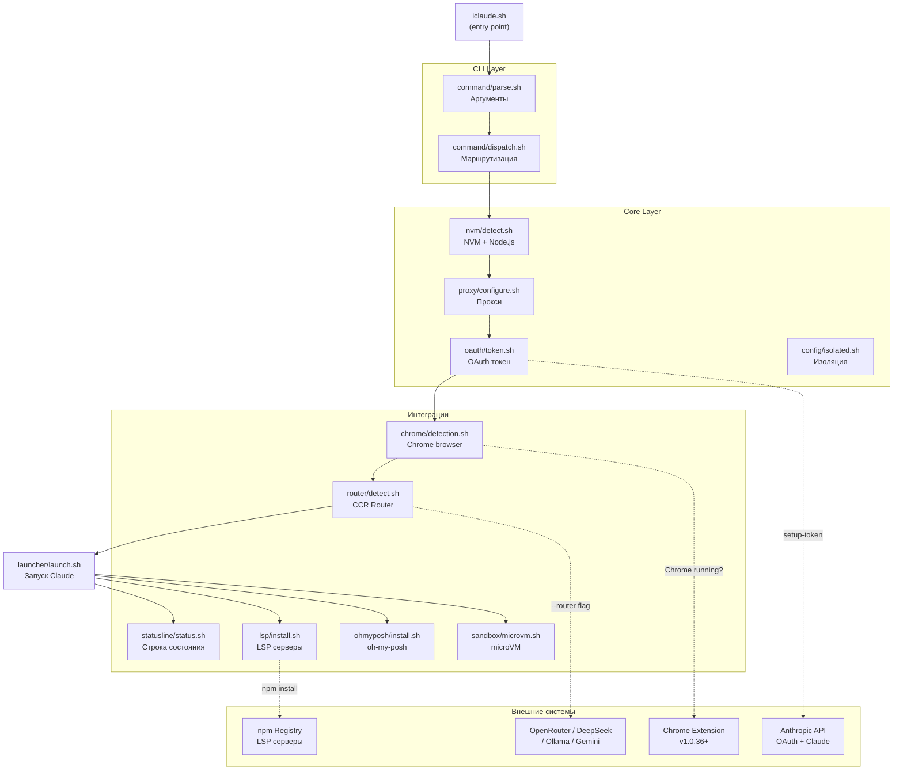
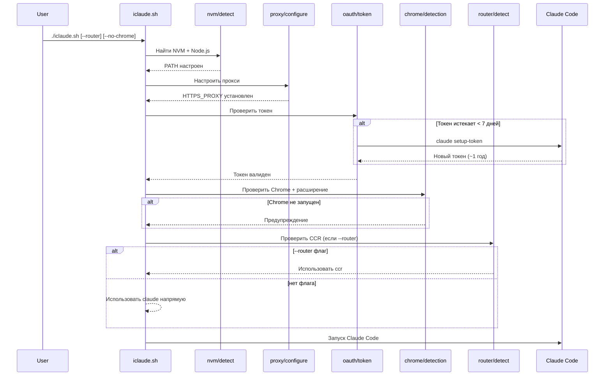
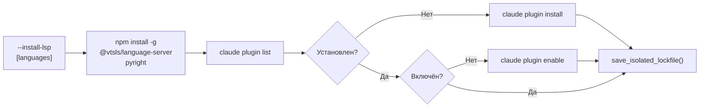
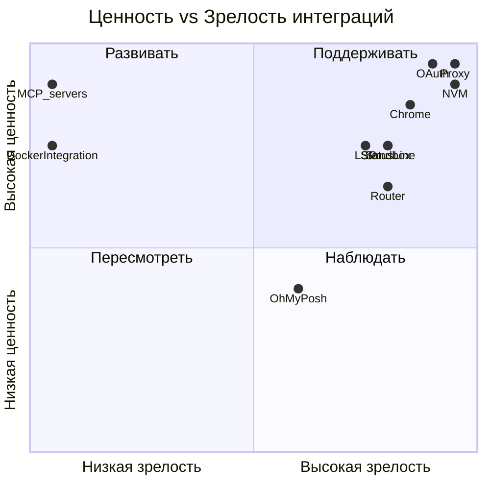

# Интеграции iclaude: AI-эффективность и возможности

> Обзор интеграций с точки зрения того, **что они дают пользователю Claude Code как AI-инструмента** —
> какие возможности открывают, насколько повышают качество работы с ИИ, где есть ограничения.
>
> Дата: 2026-02-19 | Версия: 4.0

---

## Содержание

- [AI-возможности по интеграциям](#ai-возможности-по-интеграциям)
- [Карта взаимодействий](#карта-взаимодействий)
- [Детальный обзор интеграций](#детальный-обзор-интеграций)
- [Scoring таблица](#scoring-таблица)
- [Рекомендуемые дополнительные интеграции](#рекомендуемые-дополнительные-интеграции)
- [Интеграции перегружающие проект](#интеграции-перегружающие-проект)

---

## AI-возможности по интеграциям

Ключевой вопрос для каждой интеграции: **что именно она добавляет к возможностям Claude Code как AI-агента?**

| Интеграция | AI-возможность | Без интеграции | С интеграцией |
|------------|---------------|----------------|---------------|
| **Chrome** | Агент видит и управляет браузером | Работа только с файлами/кодом | Полноценная web-автоматизация: навигация, клики, скрейпинг, запись GIF |
| **Router** | Выбор LLM-провайдера | Только Anthropic Claude | DeepSeek/Gemini/Ollama/GPT-4 — по задаче или стоимости |
| **OAuth** | Непрерывная сессия | Токен истекает, сессия обрывается | Автоматическое продление — сессии работают ~1 год без вмешательства |
| **LSP** | Code intelligence в контексте | Синтаксическое дерево без семантики | Hover, go-to-definition, типы — ИИ видит больше о структуре кода |
| **Sandbox** | Безопасное выполнение кода | Код выполняется в окружении пользователя | Claude Code запускает код в изолированном namespace — без риска побочных эффектов |
| **Status Line** | Видимость контекста и стоимости | Расход токенов непрозрачен | Реальное время: сколько контекста осталось, кэш, стоимость сессии |
| **Router (routing)** | Интеллектуальный выбор модели | Одна модель на все задачи | Автоматически: Opus для большого контекста, DeepSeek для рутины |
| **Oh-My-Posh** | Контекст окружения в prompt | Стандартный prompt | Информация о git-ветке, окружении, модели — дополнительный контекст для ИИ |

### Критически важные для AI-работы

```
Proxy → OAuth → Chrome → Sandbox = полноценный AI-агент
```

- **Без Proxy**: Claude Code не работает в корпоративных сетях
- **Без OAuth auto-refresh**: сессия обрывается через сутки
- **Без Chrome**: агент слепой к браузеру
- **Без Sandbox**: опасно запускать код от агента

---

## Общая статистика

| Метрика | Значение |
|---------|----------|
| Всего интеграций | **10** |
| Всего модулей | **64** bash-файлов |
| Всего строк кода | **~10,276** |
| Всего функций | **193+** |
| CLI флагов | **71+** |
| Архитектура | Полностью модульная (v4.0) |
| Внешних зависимостей | `jq`, `curl`, `git`, `node`, `npm`, Python 3 |

---

## Архитектура интеграций

iclaude содержит **9 внешних интеграций**, реализованных как независимые bash-модули в `lib/`.

```
lib/
├── chrome/       # Интеграция с браузером Chrome
├── router/       # Claude Code Router (альтернативные LLM)
├── oauth/        # OAuth токены Anthropic
├── lsp/          # Language Server Protocol
├── statusline/   # Строка состояния Claude Code
├── ohmyposh/     # Oh-My-Posh промпт
├── sandbox/      # microVM (Firecracker): install, launch, status
├── proxy/        # HTTP/HTTPS прокси
└── nvm/          # NVM / Node.js окружение
```

---

## Карта взаимодействий

### Граф зависимостей при запуске



### Последовательность запуска



### LSP и Plugin система



---

## Детальный обзор интеграций

### 1. Chrome Browser Integration

| Параметр | Значение |
|----------|----------|
| Модуль | `lib/chrome/detection.sh` |
| Файлов | 1 (74 строки) |
| Флаги | По умолчанию ВКЛ, `--no-chrome` для отключения |
| Зависимости | Google Chrome/Chromium, расширение Claude in Chrome v1.0.36+ |
| Статус | **Полная** |

**Функции:**
- `is_chrome_running()` — проверка процесса Chrome в `ps aux`
- `is_claude_chrome_extension_installed()` — сканирование `~/.config/google-chrome/*/Extensions/`
- `warn_chrome_integration()` — предупреждение если что-то недоступно

**Возможности при работе:** навигация по страницам, клики, ввод текста, чтение консоли, запись GIF.

---

### 2. Claude Code Router (Альтернативные LLM)

| Параметр | Значение |
|----------|----------|
| Модуль | `lib/router/` (3 файла) |
| Файлов | 3 (detect.sh, install.sh, status.sh) |
| Флаги | `--router` (opt-in), `--install-router`, `--check-router` |
| Зависимости | `@musistudio/claude-code-router` (npm), `router.json` конфиг |
| Статус | **Полная** |

**Поддерживаемые провайдеры:** OpenRouter, DeepSeek, OpenAI, Ollama, Gemini, Volcengine, SiliconFlow

**Маппинг моделей:** Router перехватывает вызовы к Claude API-именам (например `claude-sonnet-4-5`) и перенаправляет к реальному провайдеру. Пример: `claude-sonnet-4-5` → DeepSeek `deepseek-chat`.

**Правила маршрутизации** из `router.json`:
- `context_length > 60000` → Opus (через OpenRouter)
- `thinking_required` → Sonnet 3.5 (через OpenRouter)
- По умолчанию → `claude-sonnet-4-5` (mapped to DeepSeek)

**По умолчанию:** нативный Claude (без Router).

---

### 3. OAuth Token Management

| Параметр | Значение |
|----------|----------|
| Модуль | `lib/oauth/token.sh` (261 строка) |
| Файлов | 1 |
| Флаги | Автоматически при запуске, `--refresh-token` для ручного |
| Зависимости | `jq`, Claude Code CLI, браузер для OAuth |
| Статус | **Полная** |

**Логика:** проверяет `expiresAt` в `.credentials.json`, обновляет если < 7 дней до истечения через `claude setup-token` (~1 год токены).

---

### 4. Language Server Protocol (LSP)

| Параметр | Значение |
|----------|----------|
| Модуль | `lib/lsp/` (3 файла) |
| Файлов | 3 (install.sh, status.sh, repair.sh) |
| Флаги | `--install-lsp [langs]`, `--check-lsp` |
| Зависимости | npm, Claude Code CLI (`claude plugin`), Go/Rust toolchain |
| Статус | **Полная** |

**Поддерживаемые языки:**
- ✅ TypeScript и Python — полная автоматизация (npm install + claude plugin)
- ⚠️ Go и Rust — только вывод инструкций для ручной установки
- ❌ C#, Java, Kotlin, Lua, PHP, C/C++, Swift — в коде не реализованы (упомянуты в CLAUDE.md, но отсутствуют в `lib/lsp/install.sh`)

---

### 5. Status Line

| Параметр | Значение |
|----------|----------|
| Модуль | `lib/statusline/` (detect.sh, install.sh, status.sh) |
| Файлов | 3 + скрипт `claude-statusline.sh` (генерируется при установке) |
| Флаги | `--install-statusline` |
| Зависимости | `jq`, session data, oh-my-posh (опционально) |
| Статус | **Полная** |

**Формат:** `112,762 total | 50,000 active (25%) [cache]79K Sonnet 4.5 $1.06 [proxy] [router]deepseek [master]`

**Оптимизация:** append-only режим (19x быстрее полной генерации).

---

### 6. Oh-My-Posh

| Параметр | Значение |
|----------|----------|
| Модуль | `lib/ohmyposh/` (3 файла) |
| Файлов | 3 (detect.sh, install.sh + файл темы) |
| Флаги | `--install-ohmyposh` |
| Зависимости | `curl`, `jq`, `tar`, GitHub Releases API |
| Статус | **Полная** |

**Платформы:** linux-amd64, linux-arm64, darwin-amd64, darwin-arm64.

---

### 7. microVM Sandbox (Firecracker kernel isolation)

| Параметр | Значение |
|----------|----------|
| Модуль | `lib/sandbox/` (microvm.sh, install.sh, status.sh, guest-init.sh) |
| Файлов | 4 |
| Флаги | `--sandbox-microvm`, `--install-microvm`, `--check-microvm` |
| Зависимости | KVM (`/dev/kvm`), `iproute2`, `iptables` |
| Статус | **Полная (v2)** |

**Назначение:** запуск Claude Code внутри изолированной Firecracker VM с отдельным Linux kernel. Максимальная защита от prompt injection → kernel exploit.

**Платформы:** Linux (KVM required), WSL2 (nested virtualization). macOS/WSL1 — не поддерживаются.

**Документация:** [docs/MICROVM.md](./MICROVM.md)

---

### 8. Proxy Management

| Параметр | Значение |
|----------|----------|
| Модуль | `lib/proxy/` (4 файла) |
| Файлов | 4 (validate.sh, configure.sh, credentials.sh, git.sh) |
| Флаги | `--proxy URL`, `--no-proxy`, `--test`, `--proxy-ca` |
| Зависимости | `curl`, `openssl` (опционально) |
| Статус | **Полная** |

**Протоколы:** HTTPS (рекомендован), HTTP. SOCKS5 — **не поддерживается** (undici).

---

### 9. NVM / Node.js (базовая инфраструктура)

| Параметр | Значение |
|----------|----------|
| Модуль | `lib/nvm/` (6 файлов) |
| Файлов | 6 (detect, claude, install, setup, cleanup, repair) |
| Флаги | `--isolated-install`, `--repair-isolated`, `--cleanup-isolated` |
| Зависимости | `curl`, `bash`, интернет |
| Статус | **Полная** |

---

## Scoring таблица

> Оценка с точки зрения **ценности для AI-работы** с Claude Code.
> Шкала: 1 (низко) → 5 (высоко). Итог = среднее четырёх критериев.

| Интеграция | AI-ценность | Зрелость | Надёжность | Обслуживаемость | **Итог** | **Приоритет** |
|------------|:-----------:|:--------:|:----------:|:---------------:|:--------:|:-------------:|
| Proxy Management | 5 | 5 | 5 | 5 | **5.0** | 🔴 Критичный |
| NVM / Node.js | 5 | 5 | 5 | 4 | **4.8** | 🔴 Критичный |
| OAuth Token | 5 | 5 | 5 | 4 | **4.8** | 🔴 Критичный |
| Chrome Integration | 5 | 5 | 4 | 4 | **4.5** | 🔴 Критичный |
| Sandbox (Claude) | 5 | 4 | 4 | 4 | **4.3** | 🟠 Высокий |
| LSP Servers | 4 | 4 | 4 | 3 | **3.8** | 🟠 Высокий |
| Status Line | 3 | 4 | 4 | 4 | **3.8** | 🟠 Высокий |
| Router (alt LLM) | 3 | 4 | 4 | 3 | **3.5** | 🟡 Средний |
| Oh-My-Posh | 2 | 3 | 3 | 3 | **2.8** | 🟢 Низкий |

### Легенда критериев

| Критерий | Описание |
|----------|----------|
| **AI-ценность** | Насколько расширяет возможности Claude Code как AI-агента (1=нет, 5=критично для работы) |
| **Зрелость** | Полнота реализации (1=заглушка, 5=production-ready) |
| **Надёжность** | Обработка ошибок и graceful degradation (1=нет, 5=отличная) |
| **Обслуживаемость** | Лёгкость поддержки и обновления (1=сложно, 5=легко) |

---

## Рекомендуемые дополнительные интеграции

### Высокий приоритет

| Интеграция | Ценность | Сложность | Описание |
|------------|:--------:|:---------:|----------|
| **MCP Server Management** | ⭐⭐⭐⭐⭐ | 3/5 | Автоустановка/обновление MCP серверов в `mcp.json`. Аналогично LSP плагинам |
| **Docker Integration** | ⭐⭐⭐⭐ | 3/5 | Изолированный запуск Claude Code в контейнере. Полная изоляция файловой системы |
| **Auto-update Lockfile** | ⭐⭐⭐⭐ | 2/5 | Автопроверка новых версий компонентов и обновление lockfile при изменениях |
| **Pre-commit Hooks** | ⭐⭐⭐⭐ | 2/5 | Интеграция `husky`/`pre-commit` для автоматического code review при коммите |

### Средний приоритет

| Интеграция | Ценность | Сложность | Описание |
|------------|:--------:|:---------:|----------|
| **Direnv** | ⭐⭐⭐ | 1/5 | Автоматическая загрузка env vars из `.envrc` при входе в директорию |
| **tmux/Screen** | ⭐⭐⭐ | 2/5 | Persistent sessions, множество окон, attach/detach |
| **Metrics Dashboard** | ⭐⭐⭐ | 3/5 | Визуализация использования токенов, стоимости, популярных команд через InfluxDB/Grafana |
| **Slack/Telegram Notify** | ⭐⭐⭐ | 2/5 | Уведомления о завершении задач |
| **Cloud Backup** | ⭐⭐⭐ | 3/5 | Автоматическое резервное копирование `.claude-isolated/` в S3/GCS |

### Низкий приоритет / Экспериментальные

| Интеграция | Ценность | Сложность | Описание |
|------------|:--------:|:---------:|----------|
| **Jupyter Integration** | ⭐⭐ | 4/5 | Запуск Claude в контексте Jupyter Notebook |
| **VS Code Extension** | ⭐⭐ | 5/5 | GUI для управления iclaude из VS Code |
| **Web UI Dashboard** | ⭐⭐ | 4/5 | Веб-интерфейс для мониторинга и управления |
| **AI Model Benchmarks** | ⭐⭐ | 3/5 | Сравнительное тестирование провайдеров из Router |

---

## Интеграции перегружающие проект

> Предупреждения о сложности, которые стоит учитывать при развитии проекта.

### Проблемы текущих интеграций

#### ⚠️ Oh-My-Posh — дублирование функции Status Line

```
Проблема: Две системы для кастомизации промпта/строки состояния
          - claude-statusline.sh (специфичный для Claude Code)
          - oh-my-posh (general-purpose промпт)
Риск:     Конфликт конфигураций, путаница пользователей
Рекомендация: Определить чёткую границу: oh-my-posh для терминала,
              statusline для Claude Code UI
```


### Общие рекомендации по балансу

| Рекомендация | Обоснование |
|--------------|-------------|
| Не добавлять Docker без чёткого use-case | Увеличивает зависимости на 500MB+ |
| Не добавлять веб-интерфейс | Противоречит CLI-природе проекта |
| Не дублировать LSP логику | Claude Code имеет собственный plugin API |
| MCP серверы — следующий логичный шаг | Нативная интеграция с Claude Code |

---

## Итоговая карта зрелости



---

*Документ сгенерирован на основе анализа 64 bash-файлов в 22 директориях `lib/`. Версия архитектуры: 4.0 (полностью модульная).*
