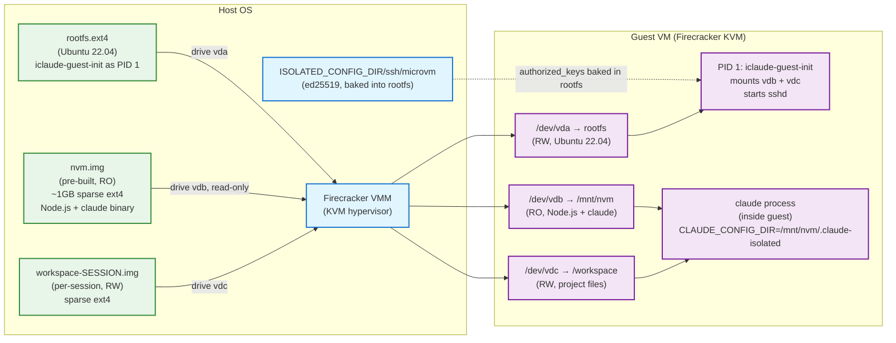
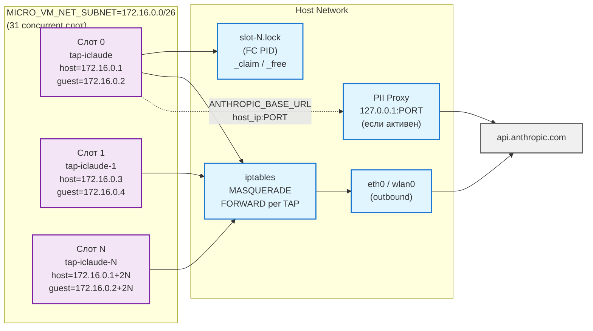

# Поток запуска через microVM (Firecracker v2)

Показывает процесс запуска Claude Code с kernel isolation через Firecracker VMM и virtio-blk block devices.

## Архитектура v2 (текущая)

Claude Code выполняется **внутри guest VM** по SSH. Host управляет только lifecycle VM и синхронизацией workspace. Три блочных устройства: rootfs (`/dev/vda`), NVM-образ с Node.js + claude (`/dev/vdb`, RO), per-session workspace (`/dev/vdc`, RW).

## Ключевые этапы

1. Аллокация сетевого слота (`_alloc_microvm_slot`) — уникальная пара IP из пула `MICRO_VM_NET_SUBNET`
2. Проверка/обновление TAP-интерфейса для слота (`_ensure_slot_tap`)
3. Создание sparse workspace.img (ext4, per-session)
4. Генерация guest env файла (`configure_guest_environment`)
5. Сборка Firecracker JSON config — drives + network + init=
6. Запуск Firecracker VMM; guest PID 1 монтирует блочные устройства, стартует sshd
7. Polling SSH-готовности гостя (max 30s)
8. Push env файла в `/workspace` через SCP
9. Sync host→guest (tar-over-SSH, режим full/path)
10. SSH exec claude внутри guest
11. Sync guest→host (sync-back после завершения)
12. `stop_microvm()` по EXIT-трапу, `_free_microvm_slot()`

```mermaid
graph TD
    USER[User] -->|--sandbox-microvm| CLI[CLI Main]

    CLI -->|USE_MICRO_VM_FLAG=true| DETECT_CHECK[detect_microvm]

    DETECT_CHECK -->|KVM missing / no binaries| WARN[Warning: microVM not available\nContinuing without isolation]
    WARN --> STD_LAUNCH[Standard Claude Launch]

    DETECT_CHECK -->|OK| CCR_CHECK{use_router?}
    CCR_CHECK -->|yes| CCR_START[start_ccr_server]
    CCR_CHECK -->|no| PII_CHECK{use_pii_proxy?}
    CCR_START --> CCR_FAIL{started?}
    CCR_FAIL -->|no| ABORT[print_error + exit 1]
    CCR_FAIL -->|yes| PII_CHECK

    PII_CHECK -->|yes| PII_START[start_pii_proxy_server\n127.0.0.1:PORT]
    PII_CHECK -->|no| ALLOC_SLOT
    PII_START --> PII_FAIL{started?}
    PII_FAIL -->|no| STOP_CCR[stop_ccr_server] --> ABORT
    PII_FAIL -->|yes| ALLOC_SLOT

    ALLOC_SLOT[_alloc_microvm_slot\nsubnet pool → slot N\nhost IP, guest IP, TAP]
    ALLOC_SLOT --> ENSURE_TAP

    ENSURE_TAP[_ensure_slot_tap\nсоздать TAP если нет\nобновить IP если мисматч]
    ENSURE_TAP --> CREATE_WS

    CREATE_WS[Create sparse workspace.img\ndd + mkfs.ext4\nper-session в session_dir/]
    CREATE_WS --> GUEST_ENV

    GUEST_ENV[configure_guest_environment\n→ session_dir/guest-env.sh\nHTTPS_PROXY, ANTHROPIC_BASE_URL,\nCLAUDE_CONFIG_DIR]
    GUEST_ENV --> FC_CONFIG

    FC_CONFIG[build_microvm_config\nJSON: kernel + init= +\nvda=rootfs, vdb=nvm.img,\nvdc=workspace.img + TAP]
    FC_CONFIG --> RM_SOCK

    RM_SOCK[rm stale FC socket\n/tmp/iclaude-id-fc.sock]
    RM_SOCK --> FC_SPAWN

    FC_SPAWN[firecracker --api-sock\n--config-file vmconfig.json\n--log-path firecracker.log]
    FC_SPAWN --> FC_WAIT{Poll socket\nmax 10s}
    FC_WAIT -->|timeout / FC died| FC_FAIL[kill + rm session_dir\nreturn 1]
    FC_WAIT -->|socket ready| GUEST_BOOT

    GUEST_BOOT[Guest PID 1: iclaude-guest-init\nмонтирует proc/sys/dev\nvdb→/mnt/nvm, vdc→/workspace\nстартует sshd]
    GUEST_BOOT --> SSH_POLL

    SSH_POLL{Poll SSH\nguest_ip:22\nmax 30s}
    SSH_POLL -->|timeout| SSH_FAIL[kill FC + rm session_dir\nreturn 1]
    SSH_POLL -->|connected| SCP_ENV

    SCP_ENV[SCP guest-env.sh\n→ /workspace/.iclaude-guest-env.sh]
    SCP_ENV --> CLAIM_SLOT

    CLAIM_SLOT[_claim_microvm_slot\nslot-N.lock = FC PID]
    CLAIM_SLOT --> SYNC_IN

    SYNC_IN{workspace\nmode?}
    SYNC_IN -->|full / path| TAR_H2G[tar host→guest\nexclude: .nvm-isolated .git\n.claude_config .iclaude-guest-env.sh\n.iclaude-ssh]
    SYNC_IN -->|isolated| SSH_EXEC

    TAR_H2G --> SSH_EXEC

    SSH_EXEC["ssh root@guest_ip\nsource /workspace/.iclaude-guest-env.sh\nexec /mnt/nvm/npm-global/bin/claude"]

    SSH_EXEC --> EXIT_CODE[exit_code=$?]
    EXIT_CODE --> SYNC_BACK

    SYNC_BACK{workspace\nmode?}
    SYNC_BACK -->|full / path| TAR_G2H[tar guest→host\nexclude: lost+found\n.iclaude-guest-env.sh]
    SYNC_BACK -->|isolated| STOP_VM

    TAR_G2H --> STOP_VM

    STOP_VM[EXIT trap: stop_microvm\nkill FC PID\n_free_microvm_slot\nrm session_dir / socket]
    STOP_VM --> DONE[exit exit_code]

    classDef userClass fill:#e1f5ff,stroke:#1976d2,stroke-width:2px
    classDef processClass fill:#fff4e1,stroke:#f57c00,stroke-width:2px
    classDef vmClass fill:#f3e5f5,stroke:#7b1fa2,stroke-width:2px
    classDef storageClass fill:#e8f5e9,stroke:#388e3c,stroke-width:2px
    classDef errorClass fill:#ffebee,stroke:#d32f2f,stroke-width:2px
    classDef cleanupClass fill:#e0f7fa,stroke:#0097a7,stroke-width:2px

    class USER,STD_LAUNCH userClass
    class CLI,DETECT_CHECK,CCR_START,PII_START,ALLOC_SLOT,ENSURE_TAP,CLAIM_SLOT processClass
    class CREATE_WS,GUEST_ENV,FC_CONFIG,RM_SOCK,FC_SPAWN,FC_WAIT,GUEST_BOOT,SSH_POLL,SCP_ENV vmClass
    class SYNC_IN,TAR_H2G,SSH_EXEC,EXIT_CODE,SYNC_BACK,TAR_G2H storageClass
    class WARN,ABORT,FC_FAIL,SSH_FAIL errorClass
    class STOP_VM,DONE cleanupClass
```

---

## Диаграмма: изоляция filesystem через virtio-blk

Блочные устройства заменили virtiofs. `/dev/vdb` (nvm.img) монтируется read-only, `/dev/vdc` (workspace.img) — read-write. Claude выполняется **внутри guest**.

---

## Диаграмма: сетевой стек и IP-пул слотов

---

## Workspace режимы

| Режим | `MICRO_VM_WORKSPACE_MODE` | Host→Guest sync | Guest→Host sync-back |
|-------|--------------------------|-----------------|----------------------|
| `full` (default) | sync весь `$PWD` | ✅ (excl. `.nvm-isolated`, `.git`, `.claude_config`, `.iclaude-guest-env.sh`) | ✅ (excl. `lost+found`, `.iclaude-guest-env.sh`) |
| `path` | sync `MICRO_VM_WORKSPACE_PATH` | ✅ (те же exclusions) | ✅ |
| `isolated` | guest `/workspace` пустой | ❌ | ❌ |

## Совместимость с другими режимами

| Режим | Совместимость | Поведение |
|-------|--------------|-----------|
| `--sandbox-microvm` | базовый | virtio-blk + SSH exec + tar sync |
| `--sandbox-microvm --router` | ✅ | CCR стартует на host до VM, порт передаётся в guest env |
| `--sandbox-microvm --pii-proxy` | ✅ | PII proxy на host, ANTHROPIC_BASE_URL → host_ip:PORT |
| `--sandbox-microvm --pii-proxy --router` | ✅ | PII → CCR цепочка на host, guest env содержит оба порта |
| `--sandbox-microvm --system` | ❌ | Заблокировано: microVM требует isolated environment |

## Требования

| Требование | Проверка |
|-----------|---------|
| `/dev/kvm` доступен и читаем | `detect_kvm_support()` |
| Firecracker binary v1.11+ | `detect_microvm_binary()` |
| vmlinux kernel image | `$ISOLATED_CONFIG_DIR/bin/vmlinux` |
| rootfs.ext4 (Ubuntu 22.04) | `$ISOLATED_CONFIG_DIR/bin/rootfs.ext4` |
| nvm.img (pre-built NVM snapshot) | `$ISOLATED_CONFIG_DIR/bin/nvm.img` |
| tap-iclaude interface с корректным IP | `_ensure_slot_tap()` — авто-создание/обновление |
| OS: Ubuntu 22+ / Debian 10+ / ALT 10+ | `check_distro_microvm_support()` |
