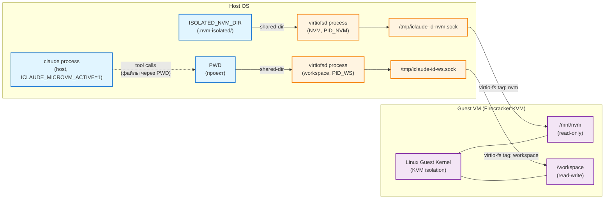
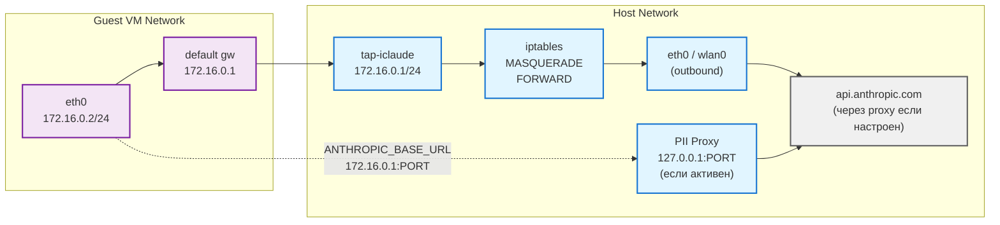

# Поток запуска через microVM (Firecracker)

Показывает процесс запуска Claude Code с kernel isolation через Firecracker VMM и virtiofs filesystem sharing.

## Архитектура v1 (текущая)

Claude Code выполняется на **host** процессе с filesystem-изоляцией через virtiofs. Guest kernel запускается внутри Firecracker, изолируя syscall attack surface от host kernel. Полное in-guest выполнение — roadmap v2.

## Ключевые этапы

1. Детекция KVM и бинарников
2. Запуск virtiofsd (NVM ro + workspace rw)
3. Генерация guest env файла (chmod 600)
4. Запуск Firecracker VMM
5. Polling API socket до готовности
6. Запуск claude (host) с `unset CLAUDECODE`
7. Cleanup по EXIT-трапу

```mermaid
graph TD
    %% microVM Launch Flow

    USER[User] -->|--sandbox-microvm| CLI[CLI Main]

    CLI -->|USE_MICRO_VM_FLAG=true| DETECT_CHECK[detect_microvm]

    DETECT_CHECK -->|KVM missing / no binaries| WARN[Warning: microVM not available\nContinuing without isolation]
    WARN --> STD_LAUNCH[Standard Claude Launch]

    DETECT_CHECK -->|OK| LAUNCH_INFO[print_info: Launching in microVM]

    LAUNCH_INFO --> CCR_CHECK{use_router?}
    CCR_CHECK -->|yes| CCR_START[start_ccr_server]
    CCR_CHECK -->|no| PII_CHECK{use_pii_proxy?}
    CCR_START --> CCR_FAIL{started?}
    CCR_FAIL -->|no| ABORT[print_error + exit 1]
    CCR_FAIL -->|yes| PII_CHECK

    PII_CHECK -->|yes| PII_START[start_pii_proxy_server]
    PII_CHECK -->|no| START_VM
    PII_START --> PII_FAIL{started?}
    PII_FAIL -->|no| STOP_CCR[stop_ccr_server] --> ABORT
    PII_FAIL -->|yes| START_VM

    START_VM[start_microvm]

    START_VM --> KVM_CHECK{/dev/kvm\nreadable?}
    KVM_CHECK -->|no| VM_FAIL[print_error + exit 1]
    KVM_CHECK -->|yes| VFSD_NVM

    VFSD_NVM[_start_virtiofsd\nISOLATED_NVM_DIR ro\n→ /tmp/iclaude-id-nvm.sock]
    VFSD_NVM --> VFSD_WS

    VFSD_WS[_start_virtiofsd\nPWD rw\n→ /tmp/iclaude-id-ws.sock]
    VFSD_WS --> GUEST_ENV

    GUEST_ENV[configure_guest_environment\n→ .iclaude-guest-env.sh\nchmod 600]
    GUEST_ENV --> FC_CONFIG

    FC_CONFIG[build_microvm_config\nJSON: kernel + rootfs +\nvirtiofs + net + logger]
    FC_CONFIG --> FC_LOG

    FC_LOG[touch firecracker.log\nFirecracker требует pre-existing file]
    FC_LOG --> FC_SPAWN

    FC_SPAWN[firecracker --api-sock\n/tmp/iclaude-id-fc.sock\n--config-file config.json\n--log-path firecracker.log]

    FC_SPAWN --> FC_WAIT{Poll socket\nmax 5s}
    FC_WAIT -->|timeout| FC_FAIL[kill Firecracker\nrm session_dir\nreturn 1]
    FC_WAIT -->|socket ready| FC_OK

    FC_OK[print_success: Firecracker started\nexport ICLAUDE_SESSION_ID\nexport MICRO_VM_PID]
    FC_OK --> TRAP_SET

    TRAP_SET{Trap combination}
    TRAP_SET -->|pii+router| TRAP_ALL[trap: stop_microvm +\nstop_pii_proxy +\nstop_ccr ON EXIT/INT/TERM]
    TRAP_SET -->|pii only| TRAP_PII[trap: stop_microvm +\nstop_pii_proxy]
    TRAP_SET -->|router only| TRAP_CCR[trap: stop_microvm +\nstop_ccr]
    TRAP_SET -->|none| TRAP_VM[setup_microvm_traps\ntrap: stop_microvm]

    TRAP_ALL --> FIND_CLAUDE
    TRAP_PII --> FIND_CLAUDE
    TRAP_CCR --> FIND_CLAUDE
    TRAP_VM --> FIND_CLAUDE

    FIND_CLAUDE[get_nvm_claude_path\nor command -v claude]
    FIND_CLAUDE --> CLAUDE_FOUND{binary\nfound?}
    CLAUDE_FOUND -->|no| STOP_ONLY[stop_microvm\nexit 1]
    CLAUDE_FOUND -->|yes| UNSET_ENV

    UNSET_ENV[unset CLAUDECODE\nexport ICLAUDE_MICROVM_ACTIVE=1]
    UNSET_ENV --> RUN_CLAUDE

    RUN_CLAUDE["$claude_bin" "$@"\nвыполняется на host\nvirtiofs изолирует FS]

    RUN_CLAUDE --> EXIT_CODE[local exit_code=$?]
    EXIT_CODE --> EXIT_TRAP

    EXIT_TRAP[EXIT трап срабатывает:\nstop_microvm]

    EXIT_TRAP --> STOP_FC[Pause VM → API\nkill MICRO_VM_PID\nwait / kill -9]
    STOP_FC --> STOP_VFSD[_cleanup_virtiofsd\nkill VIRTIOFSD_PID_NVM\nkill VIRTIOFSD_PID_WORKSPACE]
    STOP_VFSD --> CLEANUP[rm .iclaude-guest-env.sh\nrm -rf session_dir/\nrm /tmp/iclaude-id-*.sock]
    CLEANUP --> DONE[exit exit_code]

    %% Styling
    classDef userClass fill:#e1f5ff,stroke:#1976d2,stroke-width:2px
    classDef processClass fill:#fff4e1,stroke:#f57c00,stroke-width:2px
    classDef vmClass fill:#f3e5f5,stroke:#7b1fa2,stroke-width:2px
    classDef storageClass fill:#e8f5e9,stroke:#388e3c,stroke-width:2px
    classDef errorClass fill:#ffebee,stroke:#d32f2f,stroke-width:2px
    classDef cleanupClass fill:#e0f7fa,stroke:#0097a7,stroke-width:2px
    classDef trapClass fill:#fff8e1,stroke:#f9a825,stroke-width:2px

    class USER,STD_LAUNCH userClass
    class CLI,DETECT_CHECK,LAUNCH_INFO,CCR_START,PII_START,FIND_CLAUDE,UNSET_ENV processClass
    class START_VM,VFSD_NVM,VFSD_WS,GUEST_ENV,FC_CONFIG,FC_LOG,FC_SPAWN,FC_WAIT,FC_OK,RUN_CLAUDE vmClass
    class EXIT_CODE storageClass
    class WARN,ABORT,VM_FAIL,FC_FAIL,STOP_ONLY errorClass
    class EXIT_TRAP,STOP_FC,STOP_VFSD,CLEANUP,DONE cleanupClass
    class TRAP_SET,TRAP_ALL,TRAP_PII,TRAP_CCR,TRAP_VM trapClass
```

---

## Диаграмма: изоляция filesystem через virtiofs

Показывает, что именно монтируется в guest и с какими правами.



---

## Диаграмма: сетевой стек microVM



---

## Совместимость с другими режимами

| Режим | Совместимость | Поведение |
|-------|--------------|-----------|
| `--sandbox-microvm` | базовый | virtiofsd (NVM + workspace) + Firecracker |
| `--sandbox-microvm --router` | ✅ | CCR стартует на host до VM, порт передаётся в guest env |
| `--sandbox-microvm --pii-proxy` | ✅ | PII proxy на host, ANTHROPIC_BASE_URL → 172.16.0.1:PORT |
| `--sandbox-microvm --pii-proxy --router` | ✅ | PII → CCR цепочка на host, guest env содержит оба порта |
| `--sandbox-microvm --system` | ❌ | Заблокировано: microVM требует isolated environment |

## Требования

| Требование | Проверка |
|-----------|---------|
| `/dev/kvm` доступен и читаем | `detect_kvm_support()` |
| Firecracker binary | `detect_microvm_binary()` |
| vmlinux kernel image | `$ISOLATED_CONFIG_DIR/bin/vmlinux` |
| rootfs.ext4 | `$ISOLATED_CONFIG_DIR/bin/rootfs.ext4` |
| virtiofsd | `detect_virtiofsd()` (apt или cargo) |
| tap-iclaude interface | `ip link show tap-iclaude` |
| OS: Ubuntu 22+ / Debian 10+ / ALT 10+ | `check_distro_microvm_support()` |
