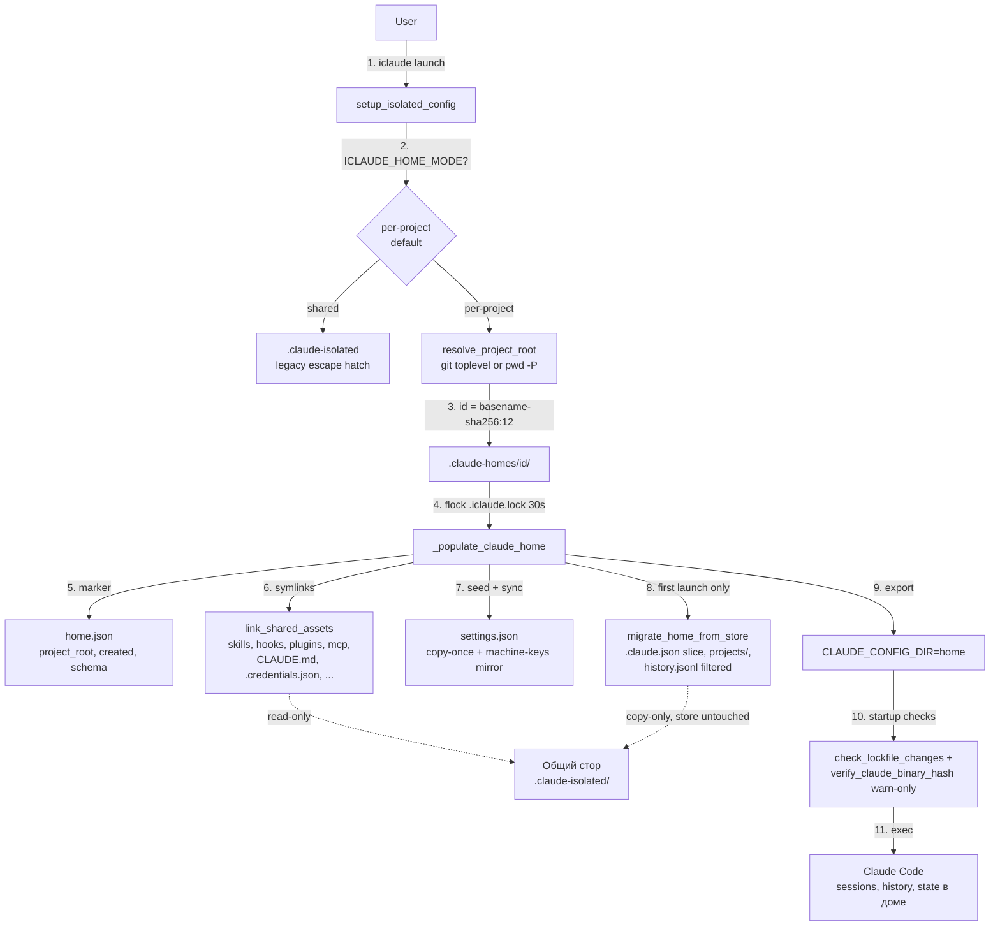

# Поток создания per-project дома и миграции

Показывает, как запуск в per-project режиме (по умолчанию с S5) строит дом проекта:
резолюция id, наполнение под локом, миграция среза общего состояния.

## Создаваемые артефакты

| Путь | Описание |
|------|----------|
| `.claude-homes/<project>-<hash>/` | Дом проекта (= `CLAUDE_CONFIG_DIR`) |
| `.claude-homes/<id>/home.json` | Маркер: корень проекта, дата, schema |
| `.claude-homes/<id>/skills, hooks, …` | Симлинки на общий стор (10 managed-имён) |
| `.claude-homes/<id>/settings.json` | Копия шаблона + зеркало машинных ключей |
| `.claude-homes/<id>/.claude.json` | Мигрированный срез (только своя запись projects) |
| `.claude-homes/<id>/.iclaude.lock` | Лок наполнения дома (flock, fail-soft) |

## Диаграмма

## Ключевые свойства

- Стор никогда не мутируется путями запуска и миграции: откат = удаление дома
  (следующий запуск мигрирует заново).
- Все мутации дома идут под fail-soft `flock`: проблема с локом — предупреждение,
  не отказ.
- Уборка домов только явными командами `--list-homes` / `--clean-homes` /
  `--clean-home <id>` (сироты, с подтверждением) — launch-путь ничего не удаляет.
