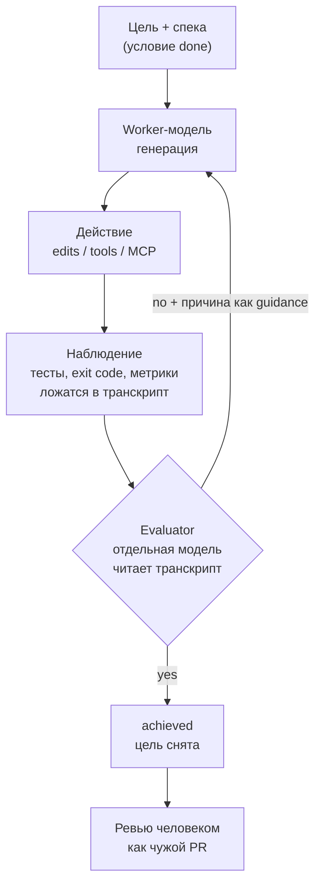

# Loop Engineering: playbook под свой стэк

Методичка по применению цикловых подходов к работе с кодовыми агентами. Структурирует два первоисточника (Boris Cherny — «the loop»; Andrej Karpathy — generation-verification loop / autonomy slider), приземляет их на механику обоих агентов (Claude Code `/goal` и Codex automations/AGENTS.md) и на конкретные проекты и оснастку (LiteLLM, Ollama, Langfuse, FastMCP, vLLM, Trino/Iceberg).

---

## 1. Два подхода в одной системе координат

| Ось | Cherny — «the loop» | Karpathy — gen-verify loop |
|---|---|---|
| Тезис | «Не промпчу — пишу циклы, которые промптят агента» | ИИ генерирует быстрее, чем человек верифицирует; узкое место сместилось на проверку |
| Единица работы | Автономная петля: находит задачу, раздаёт, проверяет, решает следующий шаг | Пара generate → verify, максимально быстрая |
| Роль человека | Архитектор петли (оркестрация, guardrails, финальный суд) | Держит поводок: мелкие правки, быстрый аудит, autonomy slider под задачу |
| Точка приложения усилий | Дизайн loop-логики, памяти, eval, обработки ошибок | Скорость и качество верификации, инкрементальность |
| Опасность | Дорогой vibe coding без eval и контроля стоимости | Гигантский дифф → человек становится бутылочным горлышком |

Подходы не конкурируют — Cherny описывает **что строить** (петлю), Karpathy — **как её держать в узде** (быстрый надёжный верификатор, поводок, инкремент). `/goal` в Claude Code — готовый кирпич, реализующий verify-половину внутри одной сессии.

---

## 2. Анатомия петли

Ключевой принцип обоих: **worker не оценивает свою работу сам**. Судит отдельный верификатор — модель или детерминированная проверка.



Критично: `/goal`-evaluator **видит только транскрипт**, сам команд не запускает и файлов не читает. Значит доказательство «done» должно попасть в вывод worker (результат теста, exit code, дифф). Условие вида «сделай хорошо» невыполнимо — нужно измеримое.

---

## 3. Слои автономии (autonomy slider → примитивы агентов)

Slider Karpathy, разложенный на реальные механизмы. Двигай слева направо по мере роста доверия к verifier. Оба агента дают эквивалентные примитивы на каждом уровне.

| Уровень | Что убирает | Claude Code | Codex |
|---|---|---|---|
| L0 | ничего (разведка) | Ручной промпт | Ручной промпт |
| L1 | per-tool подтверждения внутри хода | `auto mode` | approvals + sandbox (`read-only` / `workspace-write` / `full-access`) |
| L2 | per-turn «keep going» | `/goal <условие>` + evaluator-модель | «done» = тесты в `AGENTS.md` (Codex обучен гонять их перед завершением) |
| L2+ | руки внутри хода И между ходами | `/goal` + `auto mode` | тесты в `AGENTS.md` + `workspace-write` sandbox |
| L3 | привязку к открытой сессии | `/schedule`, hooks, GitHub Actions | Automations (standalone/project, cron) + Triage inbox; thread automation (heartbeat) |
| L4 | человека из потока целиком | sub-agents + worktrees + оркестрирующий скрипт | параллельные threads в worktrees + @Codex PR-review |

Правило: не прыгай сразу на L4. Slider вправо — только когда verifier на текущем уровне надёжен.

Правило: не прыгай сразу на L4. Slider вправо — только когда verifier на текущем уровне надёжен.

---

## 4. Правила проектирования условия (это и есть вся сложность)

Условие `/goal` — не промпт. Промпт открытый (человек читает и решает), условие резолвится в строгий yes/no. Хорошее условие несёт три вещи:

1. **Одно измеримое конечное состояние** — результат теста, exit code, число файлов, пустая очередь.
2. **Заявленный способ проверки** — как worker это докажет: `pytest exits 0`, `git status clean`.
3. **Ограничения** — что нельзя менять по пути: «другие тест-файлы не трогать».

Дополнительно:
- Механически проверяемо, без прилагательных. «Clean», «optimized», «better» evaluator не измерит.
- Указывай **scope** (какие файлы/директории), иначе worker уедет за границы.
- Добавь **failure path**: «если после 3 попыток тест падает — откатить правки файла и доложить», иначе петля крутится вслепую.
- **Спека ≠ цель.** Длинный PRD — это контекст, против которого идёт работа. Условие — одно короткое утверждение «когда стоп». Держи спеку в `CLAUDE.md`/`specs/`, а в `/goal` — измеримый критерий.
- Составные цели дробить. «Redesign auth + OAuth + tests + docs» — четыре последовательных goal, не один.

Failure modes при плохом условии: worker жжёт токены без прогресса, либо evaluator галлюцинирует успех (доказывать нечего). Оба — слив бюджета.

---

## 5. Живые примеры под стэк

Каждый пример: **цель → условие/verifier → слой автономии → оснастка под zero-cloud стэк**.

### 5.1 RAG-пайплайн `ai-wiki` — eval-driven loop

Задача: тюнинг гибридного retrieval (qwen3-embedding-4b + BM25 + qwen3-reranker, RRF) без ручного перебора.

- **Цель:** качество retrieval не ниже порога на golden-наборе русских вопросов.
- **Условие:** `ragas eval eval/golden_ru.jsonl` → `context_recall ≥ 0.85` И `faithfulness ≥ 0.90`; метрики печатаются в вывод.
- **Verifier:** DeepEval/Ragas с локальным судьёй (Ollama-модель за LiteLLM). Zero-cloud.
- **Слой:** L2+ (`/goal` + auto). Worker крутит `top_k`, веса RRF, порог реранкера, гоняет eval, читает метрики, повторяет.
- **Оснастка:** Langfuse трейсит каждый прогон петли — видно, какая комбинация подняла метрику. Условие указывает прямо на числа Ragas.

```
/goal ragas eval eval/golden_ru.jsonl показывает context_recall>=0.85 и faithfulness>=0.90;
менять только retrieval-конфиг в config/retrieval.yaml; после 5 неудач — доложить лучшую комбинацию
```

### 5.2 Passport recognition — schema-validated loop

Задача: поднять точность извлечения полей VIZ на разнородных сканах.

- **Цель:** field-level accuracy по golden-сканам ≥ порога, JSON валиден по схеме.
- **Условие:** `python eval_fields.py --golden data/golden/` → `mean_field_f1 ≥ 0.95` И `schema_errors == 0`.
- **Verifier:** детерминированный — pydantic-валидация схемы (structural через vLLM guided JSON гарантирует форму) + пофилдовое сравнение с golden. Модель-судья не нужна вовсе, проверка чисто механическая → максимально надёжный evaluator.
- **Слой:** L2. Worker правит препроцессинг (MRZ-parse, VIZ-crop, HTR-трек), не трогая схему.
- **Точка Karpathy:** verifier тут идеален — объективный, быстрый. Это тот случай, где slider можно смело двигать вправо.

### 5.3 Greenplum → Trino/Iceberg — reconciliation loop (durable)

Задача: инкрементальная выгрузка по watermark + обработка удалений через anti-join DELETE, с гарантией сходимости.

- **Цель:** источник и Iceberg-таблица сходятся по окну watermark; удалённые строки вычищены.
- **Условие:** Trino-запрос reconciliation возвращает `0` расхождений (count + checksum), exit 0.
- **Verifier:** SQL-проверка (детерминированная). Anti-join между source-снапшотом и Iceberg → пустой результат = зелёно.
- **Слой:** **L3** — это уже вне интерактивной сессии. `/schedule` ночной прогон или cron + hooks; при расхождении петля дергает reconciliation-runbook. Durable loop в духе Cherny: находит дрейф, чинит, проверяет — без человека в потоке.

### 5.4 Codebase analysis (Serena / Joern) под IDD+SDD

Здесь structural-инструменты работают на **обе** половины петли.

- **Context engineering (вход worker):** Serena даёт символьную навигацию, Joern/codegraph — CPG и граф вызовов. Worker получает точный контекст границ, а не «весь репозиторий в окно».
- **Цель:** реализовать intent из `specs/<feature>.md`, все тесты green, границы модулей не нарушены.
- **Условие:** `pytest exits 0` И Joern-запрос «нет новых рёбер вызова в запрещённые модули» возвращает пусто.
- **Verifier двойной:** тесты (поведение) + Joern (архитектурный инвариант). Второй ловит то, что тесты не видят, — расползание зависимостей.
- **Слой:** L2 + sub-agents. Один агент реализует, второй ревьюит через Serena против спеки. Разные инструкции у worker и reviewer — прямой ответ на «не давать модели оценивать себя».

### 5.5 `familyBudget` fullstack — generate → green

Классика, минимальная петля.

- **Цель:** фича из спеки работает end-to-end.
- **Условие:** `pytest exits 0` И `playwright test` зелёный.
- **Слой:** L2+. Worker пишет бэкенд+фронт, гоняет юнит и e2e, чинит до зелёного.
- Стартовая точка для освоения — где «done» доказывается механически, риск минимален.

---

## 6. Оснастка под zero-cloud: два пути

Развилка по тому, где живёт evaluator.

**Путь A — примитивы Claude Code (`/goal`, `/schedule`, hooks).**
Быстро, из коробки. Нюанс: evaluator `/goal` идёт на провайдере, к которому подключена сессия, на «small fast model» (по умолчанию Haiku — облако). Для полного zero-cloud направь Claude Code через LiteLLM на локальную модель (`ANTHROPIC_BASE_URL` → gateway) — тогда и worker, и evaluator локальные. Ценой части удобства UI.

**Путь B — своя петля-скрипт против LiteLLM gateway.**
Полный контроль: worker и judge — любые модели через единый OpenAI-совместимый интерфейс LiteLLM, всё локально. Пишешь оркестрацию сам (тот самый `while`-скрипт). Максимальный zero-cloud, максимум работы. Это буквально loop-engineering Cherny в чистом виде.

Оснастка петли под твой фикс-стэк:

| Роль в петле | Инструмент |
|---|---|
| Gateway (worker + judge) | LiteLLM (OpenAI-совместимый) |
| Локальный судья | Ollama (быстрая модель под evaluator) |
| Structured worker | vLLM + guided JSON (там, где нужен строгий формат) |
| Observability петли | Langfuse + Ragas/DeepEval |
| Actuator (петля действует) | FastMCP — открыть PR, дёрнуть runbook, записать в БД |
| Изоляция параллели | git worktree на каждого агента |
| Персистентное состояние | ClickHouse/Postgres — логи прогонов, метрики |

Без actuator (MCP) петля умеет только предлагать; с ним — оперировать.

---

## 7. Тот же паттерн в Codex

Петля тул-агностична: Codex несёт эквивалентные примитивы. Различие — в механике verify.

### Маппинг примитивов

| Функция петли | Claude Code | Codex |
|---|---|---|
| Память/контекст проекта | `CLAUDE.md`, skills | `AGENTS.md`, skills (тот же `SKILL.md` формат, вызов `$`/`/skills`) |
| Критерий «done» | `/goal <условие>` + evaluator-модель | тесты, указанные в `AGENTS.md` — Codex обучен гонять их перед завершением |
| Отдельный верификатор | Haiku-evaluator после каждого хода | детерминированные тесты + второй проход: `@Codex` PR-review либо отдельный thread-reviewer |
| Per-tool автономия | `auto mode` | approvals + sandbox (`read-only`/`workspace-write`/`full-access`) |
| Периодика вне сессии | `/schedule`, hooks, GitHub Actions | Automations (standalone/project, cron) → Triage inbox; пустой прогон сам архивируется |
| Follow-up петля в контексте | — (в рамках сессии) | Thread automations — heartbeat-будильники в том же треде, минутные интервалы |
| Изоляция параллели | `git worktree`, `--worktree` | встроенные worktrees (`$CODEX_HOME/worktrees`, detached HEAD) |
| Actuator | MCP | MCP + плагины (GitHub, Chrome и т.д.) |

### Ключевое различие в verify

- **Claude Code `/goal`** — явный **отдельный evaluator-модель** судит condition после каждого хода. Разделение worker/judge встроено в примитив.
- **Codex** — «done» определяется **тестами из `AGENTS.md`**; их гоняет сам worker. Разделение worker/judge достигается либо детерминированностью тестов, либо **вторым проходом**: `@Codex` ревьюит PR, или отдельный thread-reviewer с иными инструкциями. Встроенной per-turn модели-судьи нет — судья это тесты или ревью-агент.

Практика OpenAI (TDD-петля, дословно паттерн Karpathy generate→verify): написать тесты первыми, убедиться что падают, закоммитить как checkpoint, просить Codex реализовать до зелёного с **явным запретом менять тесты**, самому прогнать verify перед приёмкой. Команды проверки — в `AGENTS.md`, чтобы Codex знал, что определяет «done».

### Codex-родные петли под стэк

- **Durable reconciliation (пример 5.3, Greenplum→Iceberg).** Standalone automation с cron на ночь → reconciliation-SQL; расхождения падают в Triage, при дрейфе — фикс. Это Codex-родной путь для L3, чище чем ручной cron.
- **PR-babysitting review-loop.** Thread automation: «каждые N минут вернись в тред, проверь статус PR через GitHub-плагин, поправь новый фидбек ревью, доложи если есть что». Durable review-loop в контексте — аналог связки `/schedule`+hooks у Cherny.
- **Passport (5.2) / familyBudget (5.5).** `AGENTS.md` с командой проверки (`python eval_fields.py`, `pytest`, `playwright`); sandbox `workspace-write`; worktree; Codex гонит до зелёного. Verifier детерминированный — идентичен Claude Code-версии.
- **Codebase analysis (5.4).** `AGENTS.md` + Serena/Joern для контекста; `@Codex` PR-review как второй судья архитектурных границ.

### Ограничение под zero-cloud

Codex-агент завязан на инфраструктуру OpenAI (ChatGPT-аккаунт или OpenAI API key) — worker и его ревью-проход идут в облако. Для **zero-cloud worker это дисквалификатор**: чувствительные данные (паспорта, внутренние DWH) через Codex не гонять. Практический раздел ответственности:

- **Codex** — где облако допустимо: PR-ревью открытого/не-чувствительного кода, автоматизации, триаж, второй судья.
- **Claude Code через LiteLLM на локальный провайдер** или **своя петля-скрипт (путь B)** — где нужен полный zero-cloud: passport-пайплайн, DWH-reconciliation над боевыми данными.

MCP общий: FastMCP-actuator работает под обоими агентами без переписывания.

---

## 8. Антипаттерны

- **Vibe coding at scale.** Петля без eval и контроля стоимости — дорогая генерация мусора. Токены и observability — first-class с первого дня.
- **Субъективное условие.** «Оптимизируй» → evaluator либо стопорит петлю, либо галлюцинирует успех.
- **Worker судит себя.** Всегда отдельный verifier (модель с другими инструкциями либо детерминированная проверка).
- **Доказательство не в транскрипте.** Evaluator видит только вывод — если тест прошёл, но результат не напечатан, для evaluator его нет.
- **Составная мега-цель.** Дробить на последовательные goal с отдельным measurable end state.
- **Слепая вера в achieved.** Evaluator читал только транскрипт. Ревизуй результат как чужой PR (headless-рендер может «пройти» проверку, не проверив то, что надо).
- **Review bandwidth = потолок.** Worktrees убирают механические коллизии, но сколько петель реально утянешь — решает твоя пропускная способность ревью, не инструмент.

---

## 9. Чеклист внедрения (slider слева направо)

1. Взять задачу, где «done» доказывается **механически** (тест, exit code, метрика) — напр. 5.2 или 5.5.
2. Сформулировать условие: end state + способ проверки + constraints + failure path.
3. Прогнать на L2 (`/goal`), вручную ревизуя каждый achieved.
4. Убедиться, что verifier не обманывается → добавить L1 (`auto mode`), уйти из per-turn.
5. Подключить Langfuse — мерить стоимость и прогресс петли.
6. Для периодики поднять L3 (`/schedule`/hooks) — пример 5.3.
7. Где нужен второй судья по смыслу — sub-agent-reviewer с отдельными инструкциями (5.4).
8. Только освоив verify — собирать L4: оркестрирующий скрипт, который сам находит работу.

Мета-навык (по Karpathy): научиться **когда отпустить петлю, а когда забрать управление**. Строй петлю как инженер, который остаётся инженером, а не как тот, кто просто жмёт «go».

---

*Источники подхода: публичные выступления и посты Boris Cherny (Claude Code); доклад Andrej Karpathy «Software Is Changing (Again)» / Software 3.0; документация `/goal` Claude Code. Приземление на стэк и примеры — адаптация под текущие проекты.*
