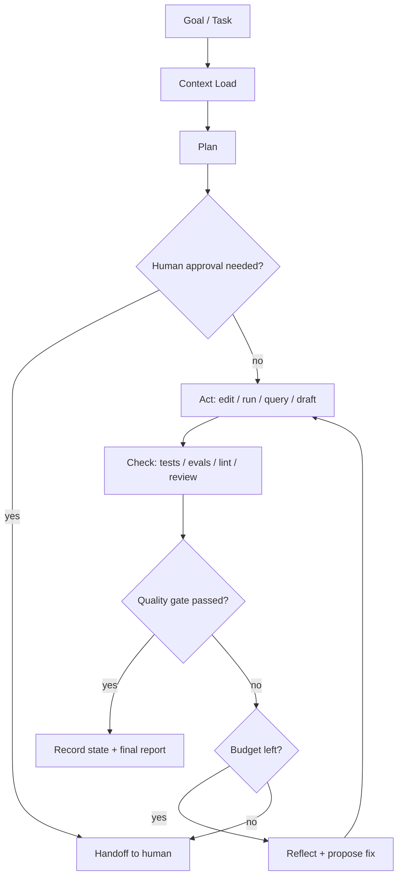

# Паттерн работы через Loop: подходы Бориса Черного и Андрея Карпати, применение в Codex и Claude Code

**Версия:** 0.2, reviewed  
**Дата:** 2026-07-01  
**Статус:** RFC / рабочая спецификация  
**Назначение:** описать практический паттерн постановки и выполнения задач через агентные циклы: от delivery-задач в коде до autoresearch-экспериментов с метриками качества.  
**Контекст применения:** Codex, Claude Code, локальные LLM/VLM/OCR-пайплайны, Lemonade inference, Langfuse/evals/CI.

---

## 0. Что изменено после ревью v0.1

Документ v0.1 был концептуально корректен, но требовал усиления по пяти направлениям:

1. **Уточнена терминология.** Loop engineering — пока не формальный стандарт, а практический emerging-паттерн вокруг coding agents. Поэтому в документе он описан как инженерный паттерн, а не как каноническая методология.
2. **Разведены уровни циклов.** Подход Черного описывает внешний harness/control loop вокруг агентов. AutoResearch Карпати — частный research-loop с фиксированным экспериментом, ограниченной областью изменений и численной метрикой.
3. **Добавлена прикладная специфика Codex и Claude Code.** Уточнены AGENTS.md, CLAUDE.md, Skills, Subagents, Hooks, Automations/Routines, worktrees и ограничения по запуску.
4. **Добавлены governance-механизмы.** Metric cheating, leakage, PII, лицензии моделей, protected files, human handoff, rollback, experiment registry.
5. **Усилена релевантность Lemonade/OCR/VLM.** Добавлены конкретные loop-паттерны для страницы регистрации паспорта РФ с кириллическими штампами, routing OCR/VLM, debate, latency/VRAM/throughput и Langfuse traces.

---

## 1. Краткая идея

Классический способ работы с AI-агентом:

> Человек пишет промпт → агент отвечает → человек вручную уточняет → агент исправляет.

Loop-подход:

> Человек проектирует цикл: цель → контекст → план → действие → проверка → исправление → остановка или handoff человеку.

Смысл не в том, чтобы написать один «идеальный промпт». Смысл в том, чтобы задать **управляемый процесс**, который:

- сам декомпозирует цель;
- выполняет ограниченные изменения;
- проверяет результат объективными quality gates;
- логирует попытки;
- повторяет итерации только в пределах бюджета;
- передает человеку блокеры, архитектурные развилки и рискованные решения.

Минимальная формула:

```text
Goal → Context → Plan → Act → Check → Reflect/Fix → Stop/Handoff
```

---

## 2. Два подхода: Черный и Карпати

### 2.1. Подход Бориса Черного: Loop Engineering

В публичных обсуждениях вокруг Claude Code подход описывается как переход от ручного prompt engineering к **loop engineering**: человек меньше пишет разовые промпты агенту и больше проектирует систему, которая сама подает агентам задачи, проверяет результаты и решает следующий шаг.

В таком подходе loop — это **контур управления работой агента**.

Фокус:

- delivery задач;
- автоматизация повторяющихся инженерных операций;
- issue triage;
- CI failure triage;
- bug fixing;
- review;
- refactoring;
- документация;
- поддержка backlog;
- recurring routines / scheduled tasks.

Ключевая мысль:

> Человек меньше работает как оператор промптов и больше работает как проектировщик циклов, ограничений, проверяющих агентов и внешнего состояния процесса.

Важно: термин “loop engineering” стоит воспринимать как практическую рамку, а не как зрелый стандарт. Его ценность — в дисциплине: state, gates, budget, handoff, memory, reviewer split.

### 2.2. Подход Андрея Карпати: AutoResearch

AutoResearch Карпати — это частный, более строгий вариант loop-подхода для ML/R&D.

Идея:

```text
Гипотеза → изменение кода → фиксированный эксперимент → метрика → принять/откатить → новая гипотеза
```

В оригинальном паттерне AutoResearch:

- есть маленький, но реальный LLM training setup;
- агент меняет ограниченную часть кода;
- эксперимент длится фиксированное время;
- результат сравнивается по численной метрике;
- изменение принимается только если метрика улучшилась;
- человек в основном программирует не Python-код напрямую, а `program.md` — правила исследовательской организации.

Ключевая мысль:

> Агент не просто «пишет код», а ведет серию экспериментов как исследовательская лаборатория с объективной метрикой.

### 2.3. Как они соотносятся

| Аспект | Loop Engineering / Черный | AutoResearch / Карпати |
|---|---|---|
| Уровень | Общий паттерн управления агентной работой | Частный паттерн автономного исследования |
| Основной объект | Задачи, код, PR, тесты, документация, triage | ML-эксперимент, training loop, hyperparameters, architecture |
| Что оптимизируется | Выполнение задач и снижение ручного управления | Численная метрика качества |
| Проверка | Тесты, CI, линтеры, review, acceptance criteria | Eval metric: validation loss, bpb, accuracy, CER/WER |
| Роль человека | Проектирует loop, quality gates, ограничения | Проектирует research org: `program.md`, search space, метрики |
| Главный риск | Агент делает правдоподобные, но неверные изменения | Агент overfit-ится на benchmark или «читерит» метрику |
| Лучшее применение | Engineering delivery и операционные процессы | R&D, ML tuning, OCR/VLM quality improvement |

Вывод:

> AutoResearch — это loop engineering, примененный к исследованию, где есть фиксированный эксперимент, ограниченная область изменений и численная метрика.

---

## 3. Базовая архитектура loop-процесса



### 3.1. Минимальная спецификация loop

Каждый loop должен иметь:

```yaml
name: ocr-registration-page-quality-loop
owner: platform-ai
mode: delivery | repair | research | governance
objective: "Улучшить качество распознавания страницы регистрации паспорта РФ"
context_sources:
  - AGENTS.md
  - CLAUDE.md
  - docs/architecture.md
  - docs/evals/ocr_eval.md
  - datasets/eval_manifest.json
mutable_scope:
  - src/ocr_pipeline/**
  - prompts/ocr/**
  - tests/ocr/**
immutable_scope:
  - datasets/raw/**
  - datasets/ground_truth/**
  - docs/compliance/**
  - production_secrets/**
  - scripts/eval_ocr.py
quality_gates:
  - pytest tests/ocr
  - python scripts/eval_ocr.py --dataset datasets/eval_manifest.json
metrics:
  primary: field_level_accuracy.registration_page
  secondary:
    - cer_cyrillic_stamp
    - registration_authority_accuracy
    - address_accuracy
    - invalid_json_rate
    - hallucination_rate
    - latency_p95_ms
    - vram_peak_mb
budget:
  max_iterations: 5
  max_wall_time_minutes: 90
  max_cost_usd: 5
stop_conditions:
  - "all quality gates passed"
  - "primary metric improved without secondary metric regression"
  - "human decision required"
handoff_conditions:
  - "schema change required"
  - "metric improved by using suspicious shortcut"
  - "needs access to private/production data"
  - "architecture boundary unclear"
  - "model license unclear"
rollback_policy: "Revert changes that fail eval or increase latency > 20%"
logging:
  trace: langfuse
  state_file: .agent-loop/STATE.md
  experiment_registry: reports/experiments.jsonl
```

---

## 4. Слои внедрения

Для production-практики лучше разделить loops на четыре уровня.

### 4.1. Delivery loop

Назначение: делать инженерные задачи.

Примеры:

- реализовать endpoint;
- добавить тесты;
- обновить документацию;
- подготовить PR;
- разложить issue на подзадачи.

Цикл:

```text
Issue → plan → implementation → tests → review → PR summary → human review
```

### 4.2. Repair loop

Назначение: чинить уже обнаруженные сбои.

Примеры:

- failing tests;
- падающий CI;
- regression после merge;
- flaky eval;
- production incident с понятным симптомом.

Цикл:

```text
Failure signal → reproduce → isolate cause → minimal fix → regression test → verify → report
```

Отличие от delivery loop: задача не “добавить новое”, а **восстановить инвариант**. Repair loop должен быть более консервативным: меньше scope, меньше итераций, обязательная регрессионная проверка.

### 4.3. Research loop

Назначение: улучшать качество модели/пайплайна через эксперименты.

Примеры:

- подобрать OCR preprocessing;
- улучшить prompts для VLM;
- выбрать routing между OCR и VLM;
- проверить debate между несколькими open-source моделями;
- оптимизировать batch size и latency;
- сравнить Lemonade inference с альтернативной настройкой той же модели.

Цикл:

```text
Hypothesis → change one variable → run eval → compare metrics → keep/revert → log learning
```

### 4.4. Governance loop

Назначение: не дать агентам превратить систему в хаос.

Примеры:

- проверять drift метрик;
- отслеживать cost/latency;
- анализировать Langfuse traces;
- искать деградации после merge;
- проверять PII и compliance;
- формировать weekly quality report.

Цикл:

```text
Collect traces → detect anomalies → classify failures → open issues → suggest fixes → report
```

---

## 5. Рекомендуемая структура репозитория

```text
repo/
  AGENTS.md                         # постоянные инструкции для Codex и совместимых агентов
  CLAUDE.md                         # постоянный контекст для Claude Code, если используется
  README.md
  docs/
    architecture.md
    evals/
      ocr_eval.md
      vlm_eval.md
      metrics.md
      dataset_policy.md
    decisions/
      ADR-0001-loop-process.md
  .agent-loop/
    LOOP.md                         # описание активных loops
    STATE.md                        # что уже пробовали, что сработало, что нет
    QUEUE.md                        # backlog для агентов
    DECISIONS.md                    # решения человека и запреты
    RUNBOOK.md                      # как запускать проверки
    FAILURE_TAXONOMY.md             # классификация ошибок
    RISK_REGISTER.md                # известные риски loop-системы
  .codex/
    config.toml
    agents/
      pr-explorer.toml
      verifier.toml
      ocr-researcher.toml
  .claude/
    agents/
      ocr-verifier.md
      langfuse-analyst.md
    skills/
      loop-delivery/SKILL.md
      loop-autoresearch/SKILL.md
      ocr-eval/SKILL.md
  skills/
    loop-delivery/SKILL.md          # переносимый формат для Agent Skills, если нужно шарить между инструментами
    loop-autoresearch/SKILL.md
    ocr-eval/SKILL.md
  prompts/
    codex/
      delivery-loop.md
      research-loop.md
      pr-review-loop.md
    claude/
      delivery-loop.md
      research-loop.md
      hook-review.md
  scripts/
    eval_ocr.py
    eval_vlm.py
    collect_langfuse_traces.py
    compare_experiment.py
    guard_no_protected_files_changed.sh
  reports/
    latest_eval.json
    experiments.jsonl
  tests/
    ocr/
    vlm/
```

Принцип: инструкции, state, evals и guardrails должны жить **в репозитории**, а не только в chat context. Chat context исчезает, repo-state остается.

---

## 6. AGENTS.md: базовый шаблон для Codex и других coding agents

```markdown
# AGENTS.md

## Mission
You are working in this repository as an engineering agent. Your job is to make small, reviewable, test-backed changes.

## Working rules
- Always read `.agent-loop/LOOP.md` and `.agent-loop/STATE.md` before starting loop work.
- Do not modify raw datasets, ground truth, secrets, compliance documents, or production configuration unless explicitly requested.
- Prefer small diffs over large rewrites.
- Before editing, produce a short plan.
- After editing, run the smallest relevant test first, then broader checks.
- If a quality gate fails, diagnose and fix within the loop budget. Do not loop forever.
- If the task requires architecture changes, schema changes, model license decisions, or production credentials, stop and ask for human review.

## Definition of done
- The requested behavior is implemented.
- Tests or evals were added/updated when relevant.
- Existing relevant tests pass.
- The change is summarized with risks and rollback notes.
- `.agent-loop/STATE.md` is updated with what was tried and learned.

## Commands
- Unit tests: `pytest`
- OCR eval: `python scripts/eval_ocr.py --dataset datasets/eval_manifest.json --output reports/latest_eval.json`
- Lint: `ruff check .`
- Type check: `mypy src`
- Protected files guard: `bash scripts/guard_no_protected_files_changed.sh`

## Loop budget
- Max repair iterations per task: 3
- Max research iterations per run: 5
- Stop early if quality gates pass.
```

Notes:

- `AGENTS.md` должен быть коротким. Большие процедуры лучше выносить в Skills или docs.
- Если агент повторяет одну и ту же ошибку, правило нужно добавить в ближайший релевантный `AGENTS.md`.
- Для Codex можно иметь глобальный `~/.codex/AGENTS.md` и repo-level `AGENTS.md`; более локальные файлы ближе к рабочей директории уточняют правила.

---

## 7. CLAUDE.md: базовый шаблон для Claude Code

````markdown
# CLAUDE.md

## Project context
This project implements local/self-hosted OCR + VLM pipelines for document recognition. The most difficult case is Russian passport registration pages with Cyrillic stamps.

## Agent behavior
- Work through explicit loops: plan, act, check, reflect, stop.
- Keep implementation and verification separate when possible.
- Use subagents for noisy exploration, log analysis, test gap review, and security/compliance review.
- Prefer deterministic checks over subjective confidence.
- Update `.agent-loop/STATE.md` after every meaningful experiment.

## Protected areas
Do not edit:
- `datasets/raw/**`
- `datasets/ground_truth/**`
- production secrets
- compliance policy documents
- migration files without explicit approval
- `scripts/eval_ocr.py` unless the task is explicitly about eval design

## Quality gates
For OCR/VLM changes, run:

```bash
pytest tests/ocr
python scripts/eval_ocr.py --dataset datasets/eval_manifest.json --output reports/latest_eval.json
bash scripts/guard_no_protected_files_changed.sh
```

## Escalation
Escalate to human review when:
- schema changes are needed;
- eval metric improves but latency or VRAM regresses materially;
- PII handling is unclear;
- model licensing is unclear;
- the agent wants to change architecture boundaries;
- the best improvement requires modifying eval data or ground truth.
````

Notes:

- `CLAUDE.md` — место для постоянных фактов о проекте, архитектуре и соглашениях.
- Повторяемые процедуры лучше выносить в `.claude/skills/<name>/SKILL.md`.
- Для изолированных ролей лучше использовать `.claude/agents/*.md`.

---

## 8. Skill: Delivery Loop

Можно оформить как skill для Codex/Claude Code.

```markdown
---
name: loop-delivery
description: Use this skill for engineering delivery tasks that require plan, implementation, tests, verification, and a final reviewable summary.
---

# Delivery Loop Skill

## Goal
Complete one engineering task with a small, reviewable diff and objective verification.

## Steps
1. Read `AGENTS.md` or `CLAUDE.md`.
2. Read `.agent-loop/LOOP.md` and `.agent-loop/STATE.md` if present.
3. Restate the task and identify acceptance criteria.
4. Create a short plan before editing.
5. Make the smallest viable change.
6. Add or update tests.
7. Run relevant checks.
8. If checks fail, fix within budget.
9. Update `.agent-loop/STATE.md` with:
   - task;
   - files changed;
   - commands run;
   - result;
   - risks;
   - next steps.
10. Return a final summary suitable for PR description.

## Stop conditions
- All acceptance criteria pass.
- Quality gates fail for a reason requiring human decision.
- The task exceeds allowed scope.
```

Codex invocation example:

```text
Use the $loop-delivery skill to implement this issue with tests and a PR-ready summary.
```

Claude Code invocation example:

```text
/loop-delivery Implement this issue with tests and a PR-ready summary.
```

---

## 9. Skill: AutoResearch Loop

```markdown
---
name: loop-autoresearch
description: Use this skill for metric-driven experiments where the agent proposes one hypothesis, changes one bounded area, runs an eval, compares metrics, and keeps or reverts the change.
---

# AutoResearch Loop Skill

## Goal
Improve a target metric through bounded, repeatable experiments.

## Rules
- Change one main variable per experiment.
- Never modify eval data or ground truth.
- Never optimize by weakening validation.
- Keep experiments comparable.
- Record every failed attempt; failed experiments are useful data.
- Prefer reversible changes.
- Keep temperature/seed/model version fixed when the backend supports it.
- Run a held-out validation before declaring a durable improvement.

## Experiment cycle
1. Load current baseline metrics from `.agent-loop/STATE.md` or `reports/latest_eval.json`.
2. Propose one hypothesis.
3. Predict expected metric movement and risk.
4. Make a small change.
5. Run the fixed eval command.
6. Compare against baseline.
7. Keep the change only if:
   - primary metric improves;
   - secondary metrics do not regress beyond threshold;
   - implementation remains simple and explainable;
   - protected files remain unchanged.
8. Otherwise revert and log the result.
9. Update `.agent-loop/STATE.md` and `reports/experiments.jsonl`.

## Required output
- Hypothesis
- Change made
- Eval command
- Before/after metrics
- Keep/revert decision
- Risk assessment
- Next hypothesis
```

---

## 10. Пример loop для Codex

### 10.1. Delivery-задача

```text
Use the $loop-delivery skill.

Task: implement `/api/passport/registration/recognize`.

Acceptance criteria:
- Accepts image input.
- Returns JSON matching `passport_registration_v1` schema.
- Extracts full name, registration date, address, issuing/registration authority if present.
- Handles Cyrillic stamp text.
- Adds unit tests and at least one integration test with fixture images.
- Does not modify raw datasets or ground truth.

Loop rules:
1. Read AGENTS.md and docs/evals/ocr_eval.md.
2. Create a short plan.
3. Implement minimal changes.
4. Run tests and OCR eval.
5. Fix failures within 3 iterations.
6. Stop and summarize if schema or architecture change is required.
```

### 10.2. Research-задача

```text
Use the $loop-autoresearch skill.

Objective: improve Cyrillic stamp recognition on passport registration pages.

Editable scope:
- src/ocr_pipeline/preprocess.py
- prompts/ocr/registration_page.md
- src/ocr_pipeline/router.py

Do not edit:
- datasets/raw/**
- datasets/ground_truth/**
- scripts/eval_ocr.py

Primary metric:
- field_level_accuracy for registration address and registration authority.

Secondary metrics:
- CER on Cyrillic stamp text
- invalid_json_rate
- hallucination_rate
- latency_p95_ms
- vram_peak_mb

Eval command:
python scripts/eval_ocr.py --dataset datasets/eval_manifest.json --output reports/latest_eval.json

Run up to 5 experiments. Change one main thing per experiment. Keep only changes that improve the primary metric without unacceptable latency/VRAM regression. Log every attempt in `.agent-loop/STATE.md` and `reports/experiments.jsonl`.
```

### 10.3. Codex subagents для maker/checker split

Пример `.codex/config.toml`:

```toml
[agents]
max_threads = 6
max_depth = 1
```

Пример `.codex/agents/ocr-researcher.toml`:

```toml
name = "ocr_researcher"
description = "Read-heavy researcher for OCR/VLM eval failures and experiment hypotheses."
model_reasoning_effort = "medium"
sandbox_mode = "read-only"
developer_instructions = """
Analyze OCR/VLM failures and propose bounded experiments.
Do not edit files. Do not suggest changes to eval data or ground truth.
Return hypotheses with expected metric movement and risks.
"""
```

Пример `.codex/agents/ocr-verifier.toml`:

```toml
name = "ocr_verifier"
description = "Verifier for OCR/VLM changes, focused on protected files, metrics, latency, and cheating risks."
model_reasoning_effort = "high"
sandbox_mode = "read-only"
developer_instructions = """
Review diffs and eval results like a strict production owner.
Check protected files, metric validity, PII logging, latency, VRAM, and rollback.
Do not approve subjective improvements without eval evidence.
"""
```

Prompt:

```text
Review this OCR change. Spawn ocr_researcher to classify failure modes and ocr_verifier to review the diff and metrics. Wait for both and return a consolidated keep/revert recommendation.
```

---

## 11. Пример loop для Claude Code

### 11.1. Через обычный prompt

```text
Use a loop workflow for this task.

Goal: reduce OCR errors on Cyrillic registration stamps.

Process:
1. Read CLAUDE.md, `.agent-loop/LOOP.md`, and `.agent-loop/STATE.md`.
2. Use a research subagent to inspect recent eval failures and classify top error types.
3. Use an implementation agent to make one bounded improvement.
4. Use a verifier/reviewer agent to check the diff and run evals.
5. Accept the change only if metrics improve and no protected files changed.
6. Update `.agent-loop/STATE.md`.
7. Return a compact report with before/after metrics and next recommendations.

Budget:
- max 5 iterations
- stop on architecture or schema uncertainty
```

### 11.2. Через project skill

```text
/loop-autoresearch Improve Cyrillic stamp recognition for passport registration pages using the fixed OCR eval. Keep changes only if field-level accuracy improves without latency regression > 20%.
```

### 11.3. Claude subagent для verifier

Пример `.claude/agents/ocr-verifier.md`:

```markdown
---
name: ocr-verifier
description: Strict verifier for OCR/VLM changes. Use after any OCR pipeline, prompt, routing, eval, or model change.
tools: Read, Grep, Glob, Bash
model: sonnet
---

You are a strict verifier for OCR/VLM changes.

Check:
- protected files were not changed;
- eval dataset and ground truth were not modified;
- before/after metrics are comparable;
- latency and VRAM regressions are within policy;
- PII is not logged;
- model license assumptions are explicit;
- rollback path is clear.

Return:
- APPROVE or REJECT;
- evidence;
- risks;
- required fixes.
```

### 11.4. Через hooks

Hooks полезны не для «умного решения», а для детерминированных правил:

- после изменения файла запустить formatter;
- перед dangerous command заблокировать выполнение;
- после изменения prompt-файла запустить prompt lint;
- после изменения OCR pipeline запустить минимальный eval smoke test;
- при ожидании input отправить уведомление;
- логировать tool usage и команды в `.agent-loop/logs/`;
- блокировать изменения `datasets/ground_truth/**`.

Пример политики:

```json
{
  "hooks": {
    "PostToolUse": [
      {
        "matcher": "Edit|Write",
        "hooks": [
          {
            "type": "command",
            "command": "bash scripts/agent_post_edit_check.sh"
          }
        ]
      }
    ]
  }
}
```

---

## 12. Применение к Lemonade / локальному inference

Для инфраструктуры с Lemonade и локальным железом loop-подход можно применять не только к коду, но и к качеству inference.

### 12.1. Роль Lemonade

Lemonade в этой схеме — **локальный inference слой** для LLM/VLM, а не весь исследовательский контур.

Практическое разделение:

| Слой | Инструмент |
|---|---|
| Local inference | Lemonade |
| Agent orchestration | Codex / Claude Code / собственный harness |
| Evaluation | scripts/eval_ocr.py, golden datasets, reports |
| Observability | Langfuse |
| Training / fine-tuning | отдельный training stack: PyTorch/ROCm/LoRA/QLoRA/etc. |
| Governance | STATE.md, reports, CI, protected paths |

Не стоит смешивать:

- inference backend;
- training pipeline;
- agent loop;
- eval harness;
- production governance.

Loop связывает эти части, но не заменяет их.

### 12.2. Model routing loop

Цель: выбрать, когда использовать OCR, когда VLM, когда debate между моделями.

```text
Input image → OCR baseline → confidence check → VLM fallback → schema validator → debate if uncertain → final JSON
```

Метрики:

- field-level accuracy;
- confidence calibration;
- hallucination rate;
- invalid JSON rate;
- latency p50/p95;
- VRAM peak;
- throughput docs/min;
- percentage of cases requiring VLM fallback.

### 12.3. Prompt optimization loop

Цель: улучшать prompts для VLM без ручного перебора.

Правила:

- менять только один prompt block за итерацию;
- не менять eval dataset;
- фиксировать seed/temperature/model version, если backend позволяет;
- принимать изменение только при улучшении на held-out eval;
- отдельно отслеживать regression на простых страницах;
- хранить prompt version в metrics report.

### 12.4. Debate loop

Цель: повысить надежность распознавания сложных штампов.

Схема:

```text
OCR result → VLM-A extraction → VLM-B extraction → judge model → schema validator → confidence score
```

Ограничения:

- debate включается только при низкой уверенности;
- debate не должен использоваться для всех документов, иначе latency/cost взлетят;
- judge не должен видеть ground truth;
- все промежуточные ответы логируются в Langfuse;
- judge должен возвращать причину выбора, но финальный JSON должен проходить schema validation.

---

## 13. Наблюдаемость через Langfuse

Для каждого loop-run логировать:

```json
{
  "loop_name": "ocr-registration-autoresearch",
  "run_id": "2026-07-01-001",
  "agent": "codex|claude|local-llm",
  "model": "model-name",
  "task": "Improve Cyrillic stamp recognition",
  "hypothesis": "Deskew before OCR will reduce CER",
  "editable_scope": ["src/ocr_pipeline/preprocess.py"],
  "commands": ["python scripts/eval_ocr.py --dataset datasets/eval_manifest.json"],
  "metrics_before": {
    "field_level_accuracy": 0.88,
    "cer_cyrillic": 0.19,
    "latency_p95_ms": 3200
  },
  "metrics_after": {
    "field_level_accuracy": 0.90,
    "cer_cyrillic": 0.16,
    "latency_p95_ms": 3500
  },
  "decision": "keep",
  "risk": "latency increased by 9%",
  "human_review_required": false
}
```

Минимальный набор dashboard:

| Dashboard | Что показывает |
|---|---|
| Loop success rate | Доля runs, закончившихся passing gates |
| Metric delta | Изменение качества по экспериментам |
| Cost / tokens | Стоимость и токены по loop type |
| Latency / VRAM | Производительность inference |
| Handoff reasons | Почему агент остановился и позвал человека |
| Regression map | Какие изменения ухудшили какие сценарии |
| Failure taxonomy | Топ ошибок: OCR, VLM hallucination, schema, infra, timeout |
| Metric cheating alerts | Подозрительные улучшения через изменение eval/ground truth |

---

## 14. Quality gates

### 14.1. Engineering gates

- unit tests pass;
- integration tests pass;
- lint/typecheck pass;
- no protected files changed;
- diff is small and reviewable;
- PR summary includes test evidence;
- rollback path is clear.

### 14.2. Research gates

- fixed eval dataset;
- fixed metric definition;
- before/after comparison;
- no modification of ground truth;
- no metric shortcut;
- held-out split for final validation;
- improvement is statistically meaningful or at least stable across repeated runs;
- experiment is reproducible from logged config.

### 14.3. Production gates

- latency within SLO;
- VRAM within budget;
- throughput within target;
- no PII leak in logs;
- model license checked;
- fallback path exists;
- failure mode returns safe structured error;
- confidence threshold calibrated;
- schema validation enforced.

---

## 15. Anti-patterns

| Anti-pattern | Почему плохо | Как исправить |
|---|---|---|
| “Сделай OCR лучше” | Нет метрики и границ | Задать eval, primary metric, editable scope |
| Бесконечный loop | Токены и время уходят без контроля | Max iterations, max cost, stop conditions |
| Агент сам проверяет свою работу | Reviewer bias | Maker/checker split, отдельный verifier |
| Менять всё сразу | Нельзя понять причину улучшения | One main variable per experiment |
| Править eval под результат | Читерство метрики | Eval immutable, protected files |
| Автоматически merge в main | Риск незамеченной деградации | PR + human review для production |
| Хранить весь state в chat context | Контекст забывается и деградирует | State на диске: `.agent-loop/STATE.md` |
| Нет логов | Невозможно анализировать качество loop | Langfuse traces + reports |
| Нет held-out набора | Улучшение может быть overfit | Train/dev/held-out split |
| Использовать debate всегда | Latency/VRAM растут без пользы | Debate только при uncertainty |
| Смешать inference и training | Непрозрачная архитектура | Lemonade для inference, training отдельно |

---

## 16. Риски и mitigations

| Риск | Пример | Mitigation |
|---|---|---|
| Metric cheating | Агент меняет eval script или ground truth | Protected paths + verifier + git diff guard |
| Benchmark overfit | Улучшение только на 50 примерах | Held-out set + periodic dataset refresh |
| Context rot | Main thread забит логами | Subagents + summaries + state files |
| Token/cost explosion | Много agents/debate без лимита | max_iterations, max_threads, max_cost |
| Comprehension debt | Код принят без понимания | Human review for production + ADR updates |
| PII leakage | Паспортные данные в traces | redaction, sampling, synthetic fixtures |
| License risk | Непроверенная OCR/VLM модель | license gate before production |
| Latency regression | Accuracy выросла, p95 стал неприемлемым | secondary metrics + latency gate |
| Non-reproducibility | Нельзя повторить эксперимент | record model/prompt/seed/config/version |

---

## 17. Definition of Done для loop-системы

Loop-система считается внедренной, когда:

- в репозитории есть `AGENTS.md` и/или `CLAUDE.md`;
- есть `.agent-loop/LOOP.md` с описанием циклов;
- есть `.agent-loop/STATE.md` с историей попыток;
- есть хотя бы один reusable skill;
- quality gates запускаются одной командой;
- eval dataset защищен от изменений агентом;
- результаты логируются в Langfuse или аналог;
- есть human handoff policy;
- есть лимиты итераций, времени и стоимости;
- хотя бы один реальный loop прошел полный цикл от задачи до отчета;
- есть rollback policy и protected file guard;
- есть maker/checker split для production-sensitive задач.

---

## 18. План внедрения

### Этап 1. Подготовить контекст

1. Добавить `AGENTS.md`.
2. Добавить `CLAUDE.md`, если используется Claude Code.
3. Создать `.agent-loop/LOOP.md`, `.agent-loop/STATE.md`, `.agent-loop/RUNBOOK.md`.
4. Зафиксировать protected paths.
5. Зафиксировать команды тестов и evals.
6. Добавить guard script на protected files.

### Этап 2. Delivery loop

1. Выбрать одну безопасную engineering-задачу.
2. Запустить loop с max 3 iterations.
3. Проверить качество diff.
4. Добавить недостающие правила в `AGENTS.md` / `CLAUDE.md`.
5. Повторить на 3–5 задачах.

### Этап 3. Research loop

1. Зафиксировать baseline metrics.
2. Защитить eval dataset.
3. Создать `loop-autoresearch` skill.
4. Разрешить агенту менять только bounded area.
5. Запустить 5–10 экспериментов.
6. Сравнить качество с ручной baseline-работой.
7. Прогнать held-out validation.

### Этап 4. Governance loop

1. Подключить Langfuse traces.
2. Добавить dashboards.
3. Ввести taxonomy ошибок.
4. Настроить weekly report.
5. Ввести stop/handoff reasons.
6. Добавить policy по PII redaction.

---

## 19. Шаблон `.agent-loop/LOOP.md`

````markdown
# Active Agent Loops

## Loop: OCR Registration Page AutoResearch

### Objective
Improve extraction quality for Russian passport registration pages, especially Cyrillic stamp text.

### Editable scope
- `src/ocr_pipeline/**`
- `prompts/ocr/**`
- `tests/ocr/**`

### Protected scope
- `datasets/raw/**`
- `datasets/ground_truth/**`
- `scripts/eval_ocr.py`
- production secrets

### Primary metric
- `field_level_accuracy.registration_address`
- `field_level_accuracy.registration_authority`

### Secondary metrics
- `cer_cyrillic`
- `invalid_json_rate`
- `hallucination_rate`
- `latency_p95_ms`
- `vram_peak_mb`

### Eval command
```bash
python scripts/eval_ocr.py --dataset datasets/eval_manifest.json --output reports/latest_eval.json
```

### Acceptance
Keep a change only if:
- primary metric improves;
- invalid JSON does not increase;
- hallucination rate does not increase;
- latency p95 regression is <= 20%;
- no protected files changed.

### Budget
- max iterations: 5
- max wall time: 90 minutes
- max risky changes: 0

### Handoff
Stop and ask human if:
- schema change is needed;
- eval definition seems wrong;
- model license is unclear;
- access to production data is needed;
- the best improvement requires architectural rewrite.
````

---

## 20. Шаблон `.agent-loop/STATE.md`

```markdown
# Agent Loop State

## Baseline

Date: 2026-07-01
Eval command: `python scripts/eval_ocr.py --dataset datasets/eval_manifest.json`

| Metric | Value |
|---|---:|
| field_level_accuracy | TBD |
| cer_cyrillic | TBD |
| invalid_json_rate | TBD |
| hallucination_rate | TBD |
| latency_p95_ms | TBD |
| vram_peak_mb | TBD |

## Experiment log

### EXP-0001

Hypothesis: TBD  
Change: TBD  
Files changed: TBD  
Command: TBD  
Before: TBD  
After: TBD  
Decision: keep/revert  
Reason: TBD  
Next: TBD

## Known failures

| Failure type | Example | Suspected cause | Next action |
|---|---|---|---|
| Cyrillic stamp CER high | stamp text partially missed | low contrast / skew | preprocessing experiment |
| Address split wrong | street/building mixed | schema prompt ambiguity | prompt/schema validation |
| Invalid JSON | trailing comments or free text | weak output contract | stricter schema validator |
| Hallucinated authority | VLM guesses missing stamp text | low confidence without abstain rule | add abstain/unknown policy |

## Human decisions

| Date | Decision | Reason |
|---|---|---|
| TBD | TBD | TBD |
```

---

## 21. Как выбирать тип loop

| Ситуация | Тип loop |
|---|---|
| Нужно реализовать endpoint | Delivery loop |
| Нужно починить failing tests | Repair loop |
| Нужно улучшить OCR/VLM качество | Research / AutoResearch loop |
| Нужно раз в день смотреть CI failures | Governance / Triage loop |
| Нужно проверить PR с разных сторон | Parallel reviewer loop |
| Нужно выбрать модель/route/fallback | Research + governance loop |
| Нужно сделать большую архитектурную миграцию | Human-led delivery loop с агентами-помощниками |
| Нужно сравнить несколько prompts | Research loop с фиксированным eval |
| Нужно проверить PII/logging | Governance/security loop |

---

## 22. Рекомендуемые роли агентов

| Роль | Задача | Доступ |
|---|---|---|
| Planner | Декомпозиция задачи, риски, план | read-only |
| Implementer | Маленькие изменения в коде | workspace write |
| Verifier | Тесты, evals, diff review | read-only + test commands |
| Researcher | Гипотезы и анализ failures | read-only |
| Experimenter | Один bounded experiment | limited write |
| Security/Compliance reviewer | Проверка PII, secrets, risky changes | read-only |
| Reporter | Обновление STATE, отчет, PR summary | write docs only |

Важно: для автономных циклов роли **maker** и **checker** должны быть разделены.

---

## 23. Минимальный MVP для вашей OCR/Lemonade-задачи

### Неделя 1: без автономии

Цель: подготовить рельсы.

1. Создать `AGENTS.md` и `CLAUDE.md`.
2. Создать `.agent-loop/LOOP.md` и `.agent-loop/STATE.md`.
3. Зафиксировать eval dataset и golden JSON.
4. Написать `scripts/eval_ocr.py`.
5. Подключить Langfuse traces.
6. Запустить baseline Lemonade inference.
7. Сформировать failure taxonomy.

### Неделя 2: controlled delivery loop

Цель: дать агенту безопасные engineering-задачи.

1. Запускать только delivery/repair loops.
2. Запрещать изменения eval/ground truth.
3. Требовать PR summary + commands run.
4. Ввести verifier-agent.

### Неделя 3: controlled AutoResearch

Цель: дать агенту исследовательские эксперименты.

1. Разрешить менять только preprocessing/prompts/router.
2. Max 5 экспериментов за run.
3. One variable per experiment.
4. Keep/revert по метрикам.
5. Held-out validation перед merge.

---

## 24. Что не надо делать на первом этапе

- Не запускать полностью автономный overnight-loop без protected file guard.
- Не разрешать агенту менять eval script и ground truth.
- Не давать доступ к production PII без redaction.
- Не внедрять debate для всех документов.
- Не смешивать выбор inference backend с training loop.
- Не оптимизировать только accuracy без latency/VRAM.
- Не делать auto-merge в main.

---

## 25. Источники и проверенные ссылки

Проверено на 2026-07-01.

- Addy Osmani, “Loop Engineering”, 2026-06-07: https://addyosmani.com/blog/loop-engineering/
- Armin Ronacher, “The Coming Loop”, 2026-06-23: https://lucumr.pocoo.org/2026/6/23/the-coming-loop/
- Karpathy AutoResearch repository: https://github.com/karpathy/autoresearch
- OpenAI Codex AGENTS.md guide: https://developers.openai.com/codex/guides/agents-md
- OpenAI Codex best practices: https://developers.openai.com/codex/learn/best-practices
- OpenAI Codex Agent Skills: https://developers.openai.com/codex/skills
- OpenAI Codex Automations: https://developers.openai.com/codex/app/automations
- OpenAI Codex Subagents: https://developers.openai.com/codex/subagents
- Anthropic Claude Code overview: https://code.claude.com/docs/en/overview
- Anthropic Claude Code Skills: https://code.claude.com/docs/en/skills
- Anthropic Claude Code Subagents: https://code.claude.com/docs/en/sub-agents
- Anthropic Claude Code Hooks: https://code.claude.com/docs/en/hooks-guide

---

## 26. Итог

Правильная модель внедрения:

```text
Loop Engineering = внешний контур управления агентной работой
AutoResearch = исследовательский loop внутри этого контура
Codex / Claude Code = execution surfaces
Lemonade = локальный inference backend
Langfuse + evals + CI = система проверки и наблюдаемости
```

Для вашей задачи с OCR/VLM и кириллическими штампами основной фокус должен быть не на “самом умном промпте”, а на **закрытом контуре качества**:

```text
dataset → inference → structured output → eval → error taxonomy → bounded experiment → metrics → keep/revert → trace/report
```

Такой loop можно безопасно внедрять постепенно: сначала delivery/repair, затем controlled AutoResearch, затем governance и scheduled routines.
