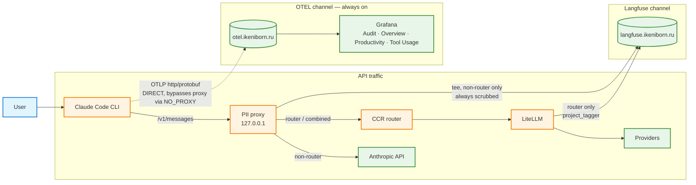

# Observability: OTEL vs Langfuse

## Overview

iclaude feeds two **independent, non-overlapping** observability channels. They are sourced differently, travel different paths, and serve different purposes — confusing them is the usual source of "metrics missing" / "double traces" questions.

- **OTEL** — emitted natively by Claude Code. Carries **metrics + log events** (aggregates: cost, tokens, sessions, tool calls, LOC; plus audit events). Goes straight to the OTLP collector → Grafana. Answers *"how much / when"*.
- **Langfuse** — the full **content** of each `/v1/messages` call (prompt + completion). Goes to self-hosted Langfuse → trace viewer. Answers *"what exactly"*.

The two never depend on each other. OTEL runs in every mode; Langfuse runs only when a capture path is active (see the mode matrix below).

## Data-flow diagram

Key point in the diagram: the **OTEL edge is dotted and leaves `Claude Code` directly** — it does NOT pass through the PII proxy. The proxy only sees API traffic on `ANTHROPIC_BASE_URL`; the OTLP exporter targets a different host that is listed in `NO_PROXY`, so it connects straight to the collector. See [[telemetry#Proxy Bypass]].

## Channel comparison

Side-by-side of what each channel emits, where it goes, and how it treats secrets — the table is the quickest way to decide which system to look in for a given question.

| | OTEL | Langfuse |
|---|---|---|
| Emitted by | Claude Code (native OTLP) | PII-proxy tee **or** LiteLLM |
| Capture point | internal exporter | `POST /v1/messages` |
| Transport | direct to collector (NO_PROXY) | direct to Langfuse |
| Destination | `otel.ikeniborn.ru` → Grafana | `langfuse.ikeniborn.ru` |
| Payload | metrics + log events | full trace (request + response) |
| Model response body | ✗ (never) | ✓ |
| Secret scrubbing | **none on this channel** | always (`_deep_scrub`) |
| Active when | `USE_OTEL=true` (opt-in), any mode | a capture path is active |
| Purpose | dashboards, billing, audit counts | per-request debugging / eval |

Overlap is limited to **token usage, model, session id, project tag** — and, only if `OTEL_LOG_USER_PROMPTS=1`, the **prompt text**. Everything else is disjoint. There is no double-trace risk: the proxy tee is suppressed in router mode (LiteLLM emits instead), so Langfuse gets exactly one trace per call regardless of mode.

## Mode matrix

Which channel carries what, per launch mode. OTEL is active whenever `ICLAUDE_USE_OTEL=true` (and not killed by `ICLAUDE_NO_TELEMETRY=1`), independent of the API-path mode below.

| Mode | Flags / config | API path | OTEL | Langfuse path | Content masking |
|---|---|---|---|---|---|
| Direct | (none) | claude → upstream proxy → Anthropic | ✓ | — (no capture) | — |
| PII proxy | `--pii-proxy` / `ICLAUDE_USE_PII_PROXY=true` | claude → PII proxy → Anthropic | ✓ | tee (if capture on) | masked (API) |
| Capture-only | `USE_LANGFUSE_CAPTURE=true`, no `--pii-proxy` | claude → PII proxy (auth+capture hop) → Anthropic | ✓ | tee (always scrubbed) | `off` (hop only) |
| Router | `--router` | claude → CCR → LiteLLM → providers | ✓ | via LiteLLM (`project_tagger`) | n/a |
| Combined | `--router` + `--pii-proxy` | claude → PII proxy → CCR → LiteLLM | ✓ | via LiteLLM | masked (API) |

Notes:
- **Langfuse needs a hop.** In non-router mode the trace is teed by the PII proxy, so capture requires the proxy to be running (`USE_LANGFUSE_CAPTURE=true` auto-starts it as the capture hop — see [[langfuse-capture#Activation]]). With no proxy and no router, Langfuse stays empty.
- **Router suppresses the tee** (`_should_capture` = false) to avoid double traces; LiteLLM's own Langfuse integration emits instead, tagged `project:<id>` via the `x-project-id` transformer (see [[router#Per-Project Tagging (X-Project-Id → Langfuse)]]).
- **OTEL is mode-agnostic** — Claude Code emits it the same way whether routed, proxied, or direct.

## Parameters

All set in `.claude_config` with the `ICLAUDE_` prefix (de-prefixed at launch — see [[config#Environment Variable Export]]).

| Variable | Channel | Effect |
|---|---|---|
| `ICLAUDE_USE_OTEL` | OTEL | `true` enables the OTEL channel (opt-in, default OFF — symmetric with `USE_LANGFUSE_CAPTURE`) |
| `ICLAUDE_NO_TELEMETRY` | OTEL | kill-switch: `1` disables OTEL even when `USE_OTEL=true` (also via `--no-telemetry`) |
| `OTEL_EXPORTER_OTLP_ENDPOINT` | OTEL | collector base URL (exporter appends `/v1/metrics`, `/v1/logs`) |
| `OTEL_EXPORTER_OTLP_CREDENTIALS` | OTEL | `user:pass`; auto-encoded to a `Basic` auth header (see [[telemetry#Authentication]]) |
| `OTEL_LOG_USER_PROMPTS` | OTEL | `0` = metrics + events without prompt **text**; `1` = include raw prompt text (see below) |
| `ICLAUDE_NO_PROXY` | OTEL | must contain the collector host so OTLP bypasses the upstream proxy |
| `USE_LANGFUSE_CAPTURE` | Langfuse | `true` enables non-router capture (starts the PII proxy as the hop) |
| `LANGFUSE_HOST` / `LANGFUSE_PUBLIC_KEY` / `LANGFUSE_SECRET_KEY` | Langfuse | self-hosted endpoint + Basic-auth keys; any missing → capture fail-soft disabled |
| `USE_PII_PROXY` / `--pii-proxy` | API path | route API traffic through the masking proxy |
| `USE_ROUTER` / `--router` | API path | route via CCR → LiteLLM; switches Langfuse to the LiteLLM path |

## `OTEL_LOG_USER_PROMPTS` — semantics and security

This flag is the **only** real content overlap between the two channels, and it carries a security caveat.

- `0` (recommended default): OTEL still emits `user_prompt` events with **metadata only** (timestamp, length). The Grafana **Audit** dashboard stays populated (activity, counts) — only the prompt *text* column is empty. Metric-based dashboards (Overview, Productivity, Tool Usage) are unaffected; they never depend on this flag.
- `1` (on-demand / forensic): includes the **raw prompt text** in OTEL logs.

**Security:** the OTEL channel has **no scrubbing**. Unlike Langfuse (whose emitter always runs `_deep_scrub`, even with proxy masking `off`), `OTEL_LOG_USER_PROMPTS=1` ships prompt text to the collector **verbatim**. Since the prompt content is already captured (scrubbed) in Langfuse, keep this `0` in steady state and flip to `1` only deliberately, for a bounded forensic/audit window. Changing it requires an `iclaude` restart.

## See also

[[telemetry]], [[langfuse-capture]], [[pii-proxy]], [[router]], [[proxy]], [[config]], [[architecture]]
